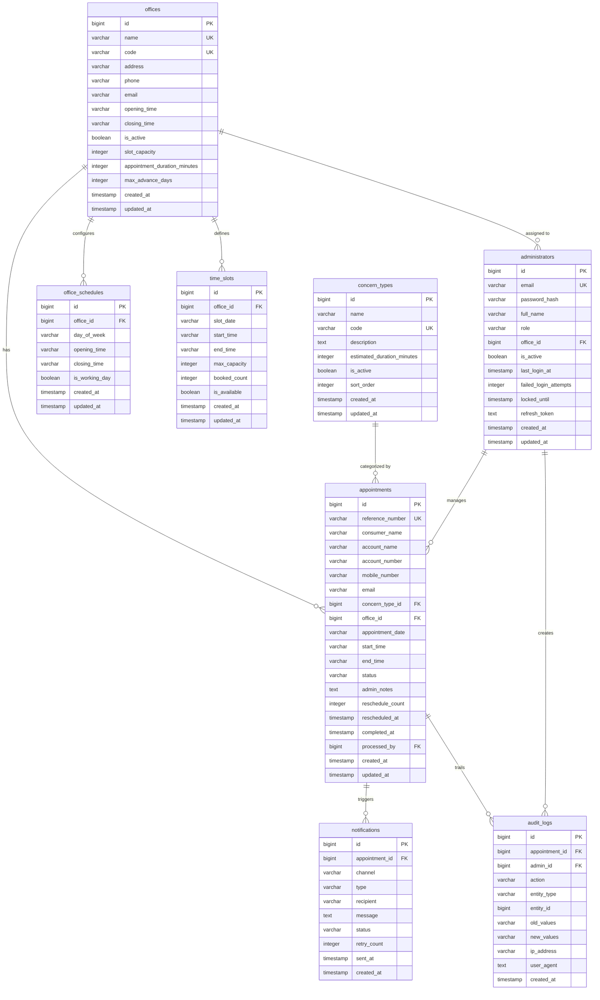

# Entity Relationship Diagram (ERD)

## ZANECO Consumer Appointment Scheduling System

## Table Relationships Summary

| Parent | Child | Type | Foreign Key |
|--------|-------|------|-------------|
| `offices` | `office_schedules` | 1:N | `office_schedules.office_id` |
| `offices` | `time_slots` | 1:N | `time_slots.office_id` |
| `offices` | `appointments` | 1:N | `appointments.office_id` |
| `offices` | `administrators` | 1:N | `administrators.office_id` |
| `concern_types` | `appointments` | 1:N | `appointments.concern_type_id` |
| `administrators` | `appointments` | 1:N | `appointments.processed_by` |
| `administrators` | `audit_logs` | 1:N | `audit_logs.admin_id` |
| `appointments` | `notifications` | 1:N | `notifications.appointment_id` |
| `appointments` | `audit_logs` | 1:N | `audit_logs.appointment_id` |

## Index Strategy

| Table | Index | Type | Purpose |
|-------|-------|------|---------|
| appointments | reference_number | UNIQUE B-tree | Lookup by ref number |
| appointments | account_number | B-tree | Search by account |
| appointments | consumer_name | B-tree (gin_trgm) | Fuzzy name search |
| appointments | mobile_number | B-tree | Search by mobile |
| appointments | status | B-tree | Filter by status |
| appointments | appointment_date | B-tree | Date range queries |
| appointments | (office_id, appointment_date) | Composite B-tree | Office daily view |
| appointments | (office_id, status, appointment_date) | Composite B-tree | Office + status + date |
| time_slots | (office_id, slot_date) | Composite B-tree | Daily slot lookup |
| time_slots | (office_id, slot_date) WHERE is_available | Partial index | Available slots |
| notifications | status WHERE pending/retrying | Partial index | Queue processing |

## Key Design Decisions

1. **Generated Column for Availability**: `time_slots.is_available` uses a PostgreSQL generated column to automatically reflect availability based on `booked_count < max_capacity`, eliminating stale data.

2. **Triggers for Slot Count**: Database triggers automatically increment/decrement `time_slots.booked_count` when appointments are created, cancelled, or marked no-show, ensuring consistency.

3. **Reference Number Sequence**: A dedicated sequence (`appointment_seq`) generates sequential numbers, combined with a prefix and date for human-readable reference numbers.

4. **JSONB for Audit Logs**: Using JSONB for old/new values allows flexible storage of entity state changes without schema changes for each entity type.

5. **Partial Indexes**: The notification queue uses a partial index to efficiently query only pending/retrying notifications, reducing index size and improving queue performance.
