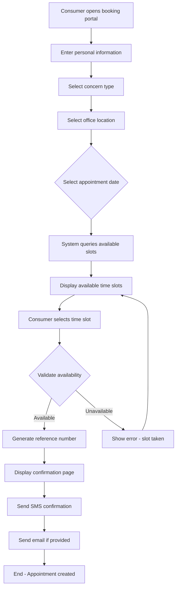
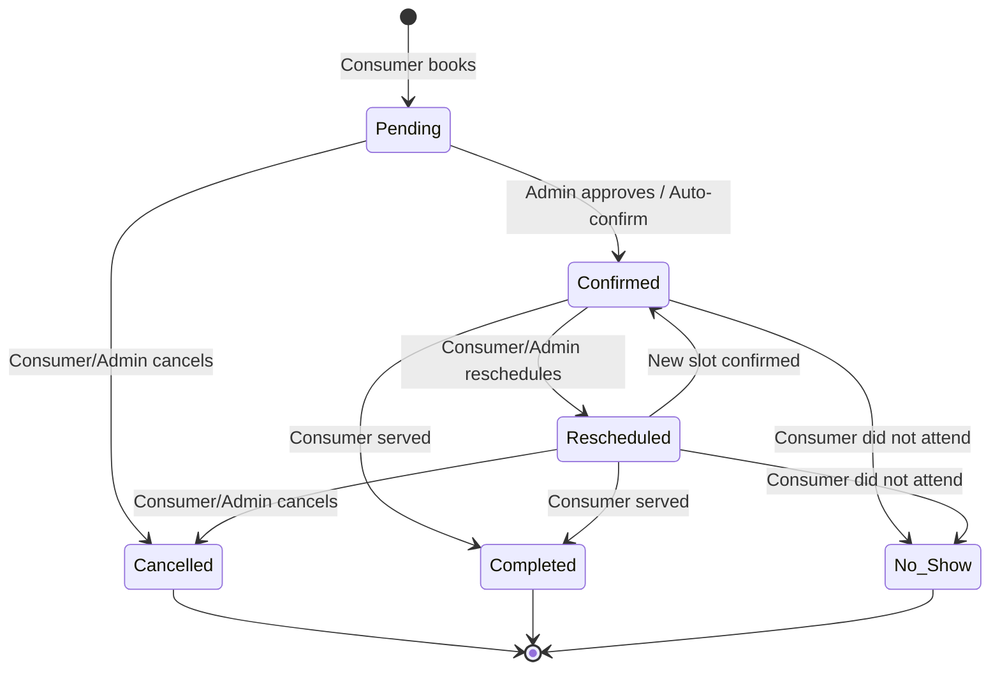
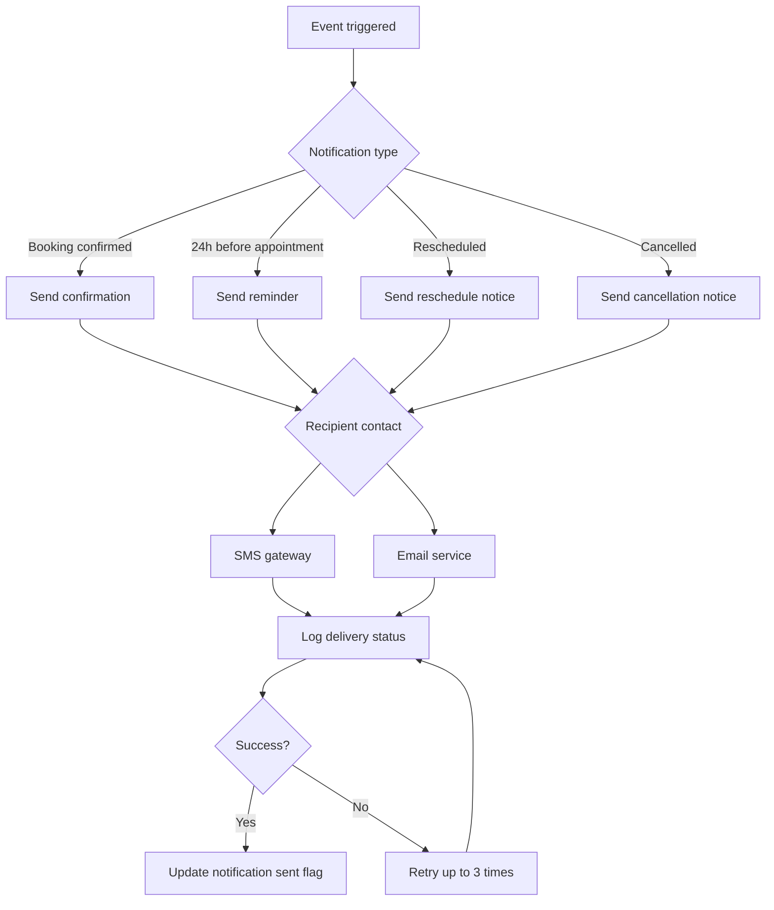
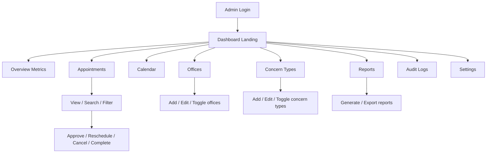
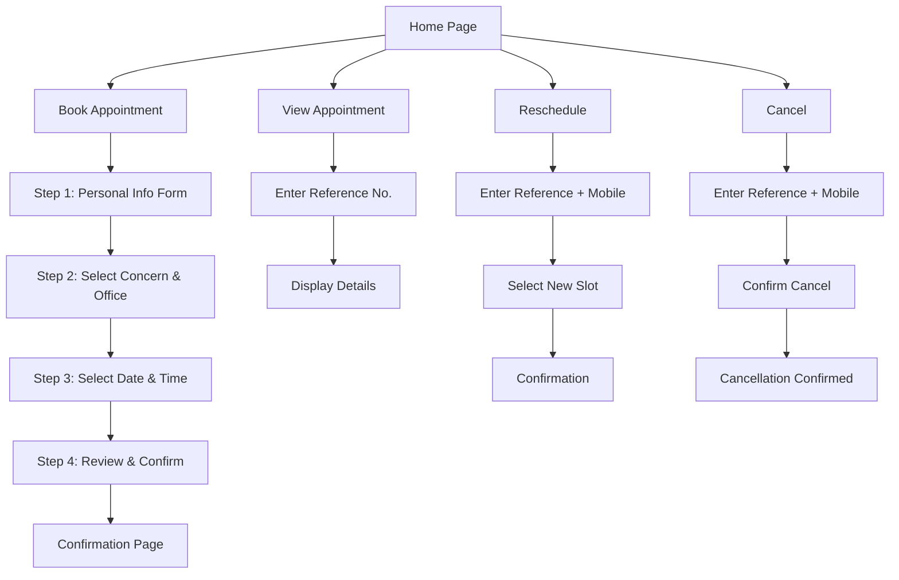
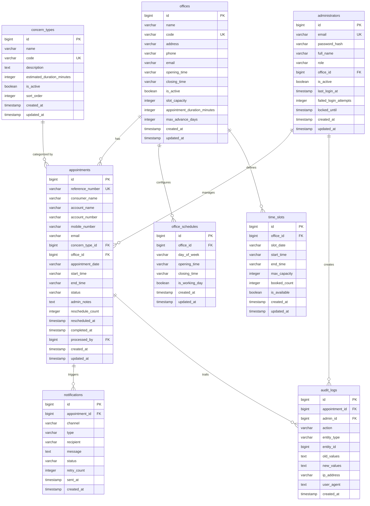

# ZANECO Consumer Appointment Scheduling System
## Complete System Design Document

---

# Table of Contents

1. [Business Requirements Document](#1-business-requirements-document)
2. [Functional Requirements](#2-functional-requirements)
3. [Non-Functional Requirements](#3-non-functional-requirements)
4. [User Stories](#4-user-stories)
5. [Use Cases](#5-use-cases)
6. [Process Flow Diagrams](#6-process-flow-diagrams)
7. [Entity Relationship Diagram (ERD)](#7-entity-relationship-diagram-erd)
8. [Database Schema](#8-database-schema)
9. [REST API Specification](#9-rest-api-specification)
10. [UI/UX Wireframes](#10-uiux-wireframes)
11. [Admin Dashboard Design](#11-admin-dashboard-design)
12. [Consumer Booking Portal Design](#12-consumer-booking-portal-design)
13. [Security Design](#13-security-design)
14. [Authentication and Authorization Model](#14-authentication-and-authorization-model)
15. [Notification Architecture](#15-notification-architecture)
16. [Reporting Module Design](#16-reporting-module-design)
17. [Deployment Architecture](#17-deployment-architecture)
18. [Technology Stack Recommendations](#18-technology-stack-recommendations)
19. [Development Roadmap](#19-development-roadmap)

---

# 1. Business Requirements Document

## 1.1 Executive Summary

ZANECO (Zamboanga del Norte Electric Cooperative) operates five Customer Service Offices (CSOs) serving consumers with billing inquiries and account concerns. Currently, consumers visit offices without appointments, resulting in long wait times, overcrowding, and inefficient service delivery.

The Consumer Appointment Scheduling System (CASS) is a web-based platform that enables consumers to schedule appointments online, receive confirmations and reminders, and visit offices at their chosen time. The system optimizes office workflows, reduces congestion, and improves consumer satisfaction.

## 1.2 Business Objectives

| Objective | Description | Success Metric |
|-----------|-------------|----------------|
| Reduce consumer wait times | Scheduled appointments eliminate walk-in queues | Average wait time < 10 minutes |
| Optimize office staffing | Predictable appointment volumes enable staff planning | Staff utilization > 75% |
| Improve consumer satisfaction | Convenient online scheduling reduces friction | Satisfaction rating > 4.0 / 5.0 |
| Increase operational efficiency | Centralized appointment management | 30% reduction in administrative overhead |
| Provide data-driven insights | Appointment analytics for management decisions | Quarterly report availability |

## 1.3 Scope

**In Scope:**
- Online appointment booking portal for consumers
- Administrative dashboard for office staff
- Appointment scheduling across 5 office locations
- Two concern types: Billing Clarification and Account Concerns
- SMS and email notifications
- Appointment lifecycle management (create, view, reschedule, cancel)
- Reporting and analytics
- Audit logging

**Out of Scope:**
- Online payment processing
- Live chat support
- Mobile native applications (responsive web only)
- Integration with existing billing systems (Phase 2)
- Consumer account portal for bill viewing/payment
- Queue management display systems at offices

## 1.4 Stakeholders

| Stakeholder | Role | Key Concerns |
|-------------|------|--------------|
| Consumers | End users booking appointments | Ease of use, availability, reminders |
| Customer Service Officers | Appointment management | Clear interface, schedule control |
| Office Managers | Oversee daily operations | Reporting, capacity planning |
| IT Administrators | System maintenance | Security, uptime, performance |
| Executive Management | Strategic oversight | ROI, consumer satisfaction, efficiency |

## 1.5 Assumptions and Constraints

**Assumptions:**
- Consumers have basic internet access and mobile phone capability
- SMS gateway service is procured separately
- Email service (SMTP) is available
- Staff will be trained on the administrative dashboard
- Office hours remain Monday to Friday, 8:00 AM - 5:00 PM

**Constraints:**
- Initial deployment supports up to 5 office locations
- Maximum 30-day advance booking window
- 30-minute appointment slots
- No real-time integration with legacy billing systems

## 1.6 Key Performance Indicators (KPIs)

| KPI | Target | Measurement |
|-----|--------|-------------|
| Online booking adoption rate | > 60% of total appointments | Monthly booking volume vs. total |
| No-show rate | < 10% | Cancelled/no-show appointments |
| Reschedule rate | < 15% | Rescheduled appointments |
| System uptime | > 99.5% | Monthly availability |
| Mobile number capture rate | > 95% | Consumers with valid mobile |
| Email capture rate | > 40% | Consumers providing email |

---

# 2. Functional Requirements

## 2.1 Consumer-Facing Module

### FR-01: Appointment Booking
| ID | Requirement | Priority |
|----|-------------|----------|
| FR-01.1 | Consumer shall enter full name (required) | High |
| FR-01.2 | Consumer shall enter name on electric account (required) | High |
| FR-01.3 | Consumer shall enter account number (required) | High |
| FR-01.4 | Consumer shall enter mobile number (required) | High |
| FR-01.5 | Consumer shall optionally enter email address | Medium |
| FR-01.6 | Consumer shall select concern type from dropdown | High |
| FR-01.7 | Consumer shall select office location from dropdown | High |
| FR-01.8 | Consumer shall select appointment date | High |
| FR-01.9 | Consumer shall select available time slot | High |
| FR-01.10 | System shall validate all required fields before submission | High |
| FR-01.11 | System shall validate mobile number format | High |
| FR-01.12 | System shall validate email format if provided | Medium |
| FR-01.13 | System shall check for double-booking | High |
| FR-01.14 | System shall generate unique reference number | High |
| FR-01.15 | System shall display confirmation with reference number | High |
| FR-01.16 | System shall send SMS confirmation | High |
| FR-01.17 | System shall send email confirmation (if email provided) | Medium |

### FR-02: View Appointment
| ID | Requirement | Priority |
|----|-------------|----------|
| FR-02.1 | Consumer shall enter reference number to view appointment | High |
| FR-02.2 | System shall display appointment details and status | High |
| FR-02.3 | System shall allow viewing without login | High |

### FR-03: Reschedule Appointment
| ID | Requirement | Priority |
|----|-------------|----------|
| FR-03.1 | Consumer shall enter reference number to reschedule | High |
| FR-03.2 | Consumer shall confirm identity via mobile number | High |
| FR-03.3 | System shall display current appointment details | High |
| FR-03.4 | Consumer shall select new date and time slot | High |
| FR-03.5 | System shall validate new slot availability | High |
| FR-03.6 | System shall update appointment status to "Rescheduled" | High |
| FR-03.7 | System shall send reschedule confirmation | High |
| FR-03.8 | System shall limit reschedule to 1 time per appointment | Low |

### FR-04: Cancel Appointment
| ID | Requirement | Priority |
|----|-------------|----------|
| FR-04.1 | Consumer shall enter reference number to cancel | High |
| FR-04.2 | Consumer shall confirm identity via mobile number | High |
| FR-04.3 | System shall prompt for cancellation confirmation | High |
| FR-04.4 | System shall update status to "Cancelled" | High |
| FR-04.5 | System shall send cancellation notification | High |

## 2.2 Administrative Module

### FR-05: Authentication
| ID | Requirement | Priority |
|----|-------------|----------|
| FR-05.1 | Administrator shall log in with email and password | High |
| FR-05.2 | System shall enforce password complexity requirements | High |
| FR-05.3 | System shall support password reset | High |
| FR-05.4 | System shall lock account after 5 failed attempts | High |
| FR-05.5 | System shall log all login attempts | Medium |

### FR-06: Appointment Management
| ID | Requirement | Priority |
|----|-------------|----------|
| FR-06.1 | Admin shall view all appointments in table format | High |
| FR-06.2 | Admin shall view appointments in calendar view | Medium |
| FR-06.3 | Admin shall filter by status, office, date, concern type | High |
| FR-06.4 | Admin shall search by reference number, account, name, mobile | High |
| FR-06.5 | Admin shall approve appointments (if enabled) | Medium |
| FR-06.6 | Admin shall reschedule appointments | High |
| FR-06.7 | Admin shall cancel appointments | High |
| FR-06.8 | Admin shall mark appointments as completed | High |
| FR-06.9 | Admin shall mark appointments as no-show | High |
| FR-06.10 | Admin shall add internal notes to appointments | Medium |
| FR-06.11 | System shall log all admin actions | High |

### FR-07: Office Management
| ID | Requirement | Priority |
|----|-------------|----------|
| FR-07.1 | Admin shall manage office locations (CRUD) | High |
| FR-07.2 | Admin shall configure office operating hours | High |
| FR-07.3 | Admin shall enable/disable offices for online booking | Medium |
| FR-07.4 | Admin shall configure office-specific slot capacity | High |
| FR-07.5 | Admin shall set max appointments per time slot per office | High |
| FR-07.6 | Admin shall configure appointment duration (default 30 min) | Medium |
| FR-07.7 | Admin shall set max advance booking days (default 30) | Medium |

### FR-08: Concern Type Management
| ID | Requirement | Priority |
|----|-------------|----------|
| FR-08.1 | Admin shall manage concern types (CRUD) | High |
| FR-08.2 | Admin shall activate/deactivate concern types | Medium |
| FR-08.3 | Admin shall configure estimated duration per concern type | Medium |

### FR-09: Reporting and Analytics
| ID | Requirement | Priority |
|----|-------------|----------|
| FR-09.1 | System shall generate total appointment reports by office | High |
| FR-09.2 | System shall generate reports by concern type | High |
| FR-09.3 | System shall generate daily/weekly/monthly reports | High |
| FR-09.4 | System shall generate status-based reports (completed, cancelled, no-show) | High |
| FR-09.5 | System shall identify peak appointment periods | Medium |
| FR-09.6 | Admin shall filter reports by date range | High |
| FR-09.7 | Admin shall export reports to PDF | High |
| FR-09.8 | Admin shall export reports to Excel/CSV | High |
| FR-09.9 | System shall display dashboard with key metrics | High |

### FR-10: Notification Management
| ID | Requirement | Priority |
|----|-------------|----------|
| FR-10.1 | System shall queue and send SMS notifications | High |
| FR-10.2 | System shall queue and send email notifications | Medium |
| FR-10.3 | Admin shall view notification history | Medium |
| FR-10.4 | System shall retry failed notifications (up to 3 times) | Medium |
| FR-10.5 | System shall send appointment reminders 24 hours before | High |
| FR-10.6 | Admin shall manually trigger notification resend | Low |

## 2.3 System-Wide Features

### FR-11: Audit Logging
| ID | Requirement | Priority |
|----|-------------|----------|
| FR-11.1 | System shall log all appointment status changes | High |
| FR-11.2 | System shall log all admin actions with timestamp and user | High |
| FR-11.3 | System shall log notification delivery attempts | Medium |
| FR-11.4 | Audit logs shall be read-only and immutable | High |
| FR-11.5 | Admin shall view audit logs (filterable) | Medium |

---

# 3. Non-Functional Requirements

## 3.1 Performance

| ID | Requirement | Target |
|----|-------------|--------|
| NFR-01 | Page load time (consumer portal) | < 3 seconds |
| NFR-02 | Page load time (admin dashboard) | < 3 seconds |
| NFR-03 | API response time (95th percentile) | < 500ms |
| NFR-04 | Concurrent user support | 200+ simultaneous |
| NFR-05 | Appointment booking processing time | < 2 seconds |
| NFR-06 | Report generation time | < 10 seconds |
| NFR-07 | Database query optimization | Indexed, < 100ms for common queries |

## 3.2 Availability

| ID | Requirement | Target |
|----|-------------|--------|
| NFR-08 | System uptime (business hours) | 99.5% |
| NFR-09 | Planned maintenance window | Sunday 2:00 AM - 6:00 AM |
| NFR-10 | Maximum unplanned downtime | 4 hours/month |
| NFR-11 | Disaster recovery RTO | 4 hours |
| NFR-12 | Disaster recovery RPO | 15 minutes |

## 3.3 Security

| ID | Requirement | Target |
|----|-------------|--------|
| NFR-13 | Data encryption at rest | AES-256 |
| NFR-14 | Data encryption in transit | TLS 1.2+ |
| NFR-15 | Password hashing | bcrypt (cost factor 12) |
| NFR-16 | Session timeout (admin) | 30 minutes inactivity |
| NFR-17 | API rate limiting | 100 requests/minute per IP |
| NFR-18 | Brute force protection | Account lockout after 5 failures |
| NFR-19 | SQL injection prevention | Parameterized queries |
| NFR-20 | XSS prevention | Output encoding, CSP headers |
| NFR-21 | CSRF protection | Token-based mitigation |

## 3.4 Scalability

| ID | Requirement | Target |
|----|-------------|--------|
| NFR-22 | Horizontal scaling support | Stateless API, shared-nothing DB |
| NFR-23 | Database scaling | Read replicas for reporting |
| NFR-24 | Storage growth handling | 3 years of appointment data minimum |
| NFR-25 | Peak load handling | 3x normal traffic during peak seasons |

## 3.5 Usability

| ID | Requirement | Target |
|----|-------------|--------|
| NFR-26 | Mobile responsive design | All pages render on 320px+ screens |
| NFR-27 | WCAG 2.1 AA compliance | Keyboard navigable, screen reader support |
| NFR-28 | Consumer portal language | Filipino and English |
| NFR-29 | Form validation feedback | Real-time inline validation |
| NFR-30 | Maximum form fields per step | 5-7 fields for booking flow |

## 3.6 Maintainability

| ID | Requirement | Target |
|----|-------------|--------|
| NFR-31 | Modular code architecture | Separation of concerns (API, service, repository) |
| NFR-32 | API versioning | URL-based versioning (v1, v2) |
| NFR-33 | Comprehensive logging | Structured logging (JSON) |
| NFR-34 | Code documentation | Inline docs, OpenAPI spec |
| NFR-35 | Test coverage | > 80% unit test, > 60% integration test |

## 3.7 Reliability

| ID | Requirement | Target |
|----|-------------|--------|
| NFR-36 | Appointment data integrity | No phantom bookings or lost data |
| NFR-37 | SMS delivery reliability | Retry mechanism with fallback |
| NFR-38 | Database backup | Hourly incremental, daily full backup |
| NFR-39 | Input validation | Server-side validation always enforced |
| NFR-40 | Idempotent booking | Prevent duplicate appointment submissions |

---

# 4. User Stories

## 4.1 Consumer Stories

| ID | Story | Acceptance Criteria |
|----|-------|-------------------|
| US-C01 | As a consumer, I want to book an appointment online so I don't have to wait in long lines at the office. | Select concern, office, date, time; receive confirmation. |
| US-C02 | As a consumer, I want to see available time slots so I can choose a convenient time. | Greyed-out full slots; clear time display. |
| US-C03 | As a consumer, I want to receive an SMS confirmation so I have proof of my appointment. | SMS sent within 2 minutes of booking. |
| US-C04 | As a consumer, I want to view my appointment details using my reference number so I can check my schedule. | Reference number lookup shows full details. |
| US-C05 | As a consumer, I want to reschedule my appointment if my plans change. | Enter reference + mobile, pick new slot. |
| US-C06 | As a consumer, I want to cancel my appointment if I no longer need it. | Enter reference + mobile, confirm cancellation. |
| US-C07 | As a consumer, I want to receive a reminder before my appointment so I don't forget. | SMS reminder 24 hours before. |
| US-C08 | As a consumer, I want to book in Filipino or English so I can use the language I'm comfortable with. | Language toggle on portal. |

## 4.2 Administrator Stories

| ID | Story | Acceptance Criteria |
|----|-------|-------------------|
| US-A01 | As an admin, I want to log in securely so unauthorized users cannot access the system. | Email + password + JWT. |
| US-A02 | As an admin, I want to see a dashboard with key metrics so I can monitor appointment volumes. | Cards showing total, pending, today's appointments. |
| US-A03 | As an admin, I want to view appointments in a calendar so I can visualize daily schedules. | Calendar view with color-coded statuses. |
| US-A04 | As an admin, I want to search appointments so I can quickly find consumer records. | Search by ref#, account#, name, mobile. |
| US-A05 | As an admin, I want to approve or cancel appointments so I can manage the schedule. | Status update with confirmation dialog. |
| US-A06 | As an admin, I want to mark appointments as completed or no-show so I can track service delivery. | Status change with timestamp. |
| US-A07 | As an admin, I want to configure office schedules and slot capacities so I can manage availability. | CRUD for offices, time slots, capacity. |
| US-A08 | As an admin, I want to generate reports so I can analyze appointment trends. | Filtered reports with PDF/Excel export. |
| US-A09 | As an admin, I want to manage concern types so the system reflects current services. | CRUD for concern type dropdown options. |

---

# 5. Use Cases

## 5.1 Consumer Use Cases

### UC-01: Book Appointment
| Element | Description |
|---------|-------------|
| **Actor** | Consumer |
| **Precondition** | Consumer has internet access and required information |
| **Trigger** | Consumer visits online booking portal |
| **Main Flow** | 1. Consumer enters personal details (name, account no., mobile, optional email) |
| | 2. Consumer selects concern type from dropdown |
| | 3. Consumer selects office location |
| | 4. System shows available dates (next 30 days) |
| | 5. Consumer selects date |
| | 6. System shows available time slots |
| | 7. Consumer selects time slot |
| | 8. System validates availability |
| | 9. System generates reference number |
| | 10. System displays confirmation page |
| | 11. System sends SMS/email confirmation |
| **Postcondition** | Appointment created with "Pending" or "Confirmed" status |
| **Alternative Flow** | 8a. Slot is unavailable: system shows error, consumer selects different slot |

### UC-02: View Appointment
| Element | Description |
|---------|-------------|
| **Actor** | Consumer |
| **Precondition** | Appointment exists in the system |
| **Trigger** | Consumer clicks "View Appointment" |
| **Main Flow** | 1. Consumer enters reference number |
| | 2. System displays appointment details (name, date, time, office, status) |
| **Postcondition** | Details displayed on screen |

### UC-03: Reschedule Appointment
| Element | Description |
|---------|-------------|
| **Actor** | Consumer |
| **Precondition** | Appointment exists and is not cancelled/completed |
| **Trigger** | Consumer clicks "Reschedule Appointment" |
| **Main Flow** | 1. Consumer enters reference number |
| | 2. Consumer enters mobile number for verification |
| | 3. System verifies match |
| | 4. System displays current appointment details |
| | 5. Consumer selects new date and time slot |
| | 6. System validates new slot availability |
| | 7. System updates appointment to "Rescheduled" |
| | 8. System sends reschedule confirmation |
| **Postcondition** | Appointment time updated, status changed |
| **Alternative Flow** | 3a. Mobile does not match: system shows error and prevents reschedule |

### UC-04: Cancel Appointment
| Element | Description |
|---------|-------------|
| **Actor** | Consumer |
| **Precondition** | Appointment exists and is not completed |
| **Trigger** | Consumer clicks "Cancel Appointment" |
| **Main Flow** | 1. Consumer enters reference number |
| | 2. Consumer enters mobile number for verification |
| | 3. System verifies match |
| | 4. System displays appointment details and asks for confirmation |
| | 5. Consumer confirms cancellation |
| | 6. System updates status to "Cancelled" |
| | 7. System sends cancellation notification |
| **Postcondition** | Appointment status is "Cancelled" |

## 5.2 Administrator Use Cases

### UC-05: Login to Admin Dashboard
| Element | Description |
|---------|-------------|
| **Actor** | Administrator |
| **Precondition** | Admin account exists in system |
| **Trigger** | Admin navigates to login page |
| **Main Flow** | 1. Admin enters email and password |
| | 2. System validates credentials |
| | 3. System generates JWT token |
| | 4. System redirects to dashboard |
| **Postcondition** | Admin authenticated, session established |
| **Alternative Flow** | 2a. Invalid credentials: error message, track failed attempts |
| | 2b. Account locked after 5 failures: show lockout message |

### UC-06: Manage Appointments
| Element | Description |
|---------|-------------|
| **Actor** | Administrator |
| **Precondition** | Admin is authenticated |
| **Main Flow** | 1. Admin navigates to Appointments page |
| | 2. System displays appointment list with filters |
| | 3. Admin can search, filter, sort appointments |
| | 4. Admin clicks on appointment to view details |
| | 5. Admin can change status (approve, complete, cancel, no-show) |
| | 6. System logs all actions |
| **Postcondition** | Appointment status updated if action performed |

### UC-07: Generate Reports
| Element | Description |
|---------|-------------|
| **Actor** | Administrator |
| **Precondition** | Admin is authenticated |
| **Main Flow** | 1. Admin navigates to Reports page |
| | 2. Admin selects report type (by office, concern, status, etc.) |
| | 3. Admin selects date range |
| | 4. System generates report |
| | 5. Admin views on screen or exports to PDF/Excel |
| **Postcondition** | Report generated and optionally exported |

### UC-08: Configure System Settings
| Element | Description |
|---------|-------------|
| **Actor** | Administrator (Super Admin role) |
| **Precondition** | Admin is authenticated with Super Admin role |
| **Main Flow** | 1. Admin navigates to Settings |
| | 2. Admin adds/edits office locations |
| | 3. Admin configures office hours and slot capacity |
| | 4. Admin manages concern types |
| | 5. System saves changes |
| **Postcondition** | System configuration updated |

---

# 6. Process Flow Diagrams

## 6.1 Appointment Booking Flow



## 6.2 Appointment Lifecycle



## 6.3 Notification Flow



## 6.4 Admin Dashboard Navigation Flow



## 6.5 Consumer Booking Portal Flow



---

# 7. Entity Relationship Diagram (ERD)



---

# 8. Database Schema

## 8.1 Complete SQL Schema

```sql
-- =============================================
-- Database: zaneco_appointments
-- PostgreSQL 15+
-- =============================================

-- Enable UUID extension
CREATE EXTENSION IF NOT EXISTS "uuid-ossp";

-- =============================================
-- ENUM Types
-- =============================================
CREATE TYPE appointment_status AS ENUM (
    'pending',
    'confirmed',
    'rescheduled',
    'cancelled',
    'completed',
    'no_show'
);

CREATE TYPE day_of_week AS ENUM (
    'monday', 'tuesday', 'wednesday', 'thursday',
    'friday', 'saturday', 'sunday'
);

CREATE TYPE admin_role AS ENUM (
    'super_admin',
    'office_manager',
    'staff'
);

CREATE TYPE notification_channel AS ENUM (
    'sms',
    'email'
);

CREATE TYPE notification_type AS ENUM (
    'confirmation',
    'reminder',
    'rescheduled',
    'cancelled'
);

CREATE TYPE notification_status AS ENUM (
    'pending',
    'sent',
    'failed',
    'retrying'
);

-- =============================================
-- Table: offices
-- =============================================
CREATE TABLE offices (
    id BIGSERIAL PRIMARY KEY,
    name VARCHAR(100) NOT NULL,
    code VARCHAR(20) NOT NULL UNIQUE,
    address TEXT,
    phone VARCHAR(20),
    email VARCHAR(100),
    opening_time TIME NOT NULL DEFAULT '08:00:00',
    closing_time TIME NOT NULL DEFAULT '17:00:00',
    is_active BOOLEAN NOT NULL DEFAULT TRUE,
    slot_capacity INTEGER NOT NULL DEFAULT 2,
    appointment_duration_minutes INTEGER NOT NULL DEFAULT 30,
    max_advance_days INTEGER NOT NULL DEFAULT 30,
    created_at TIMESTAMP WITH TIME ZONE NOT NULL DEFAULT NOW(),
    updated_at TIMESTAMP WITH TIME ZONE NOT NULL DEFAULT NOW()
);

-- =============================================
-- Table: office_schedules
-- =============================================
CREATE TABLE office_schedules (
    id BIGSERIAL PRIMARY KEY,
    office_id BIGINT NOT NULL REFERENCES offices(id) ON DELETE CASCADE,
    day_of_week day_of_week NOT NULL,
    opening_time TIME NOT NULL,
    closing_time TIME NOT NULL,
    is_working_day BOOLEAN NOT NULL DEFAULT TRUE,
    created_at TIMESTAMP WITH TIME ZONE NOT NULL DEFAULT NOW(),
    updated_at TIMESTAMP WITH TIME ZONE NOT NULL DEFAULT NOW(),
    UNIQUE(office_id, day_of_week)
);

-- =============================================
-- Table: time_slots
-- =============================================
CREATE TABLE time_slots (
    id BIGSERIAL PRIMARY KEY,
    office_id BIGINT NOT NULL REFERENCES offices(id) ON DELETE CASCADE,
    slot_date DATE NOT NULL,
    start_time TIME NOT NULL,
    end_time TIME NOT NULL,
    max_capacity INTEGER NOT NULL DEFAULT 2,
    booked_count INTEGER NOT NULL DEFAULT 0,
    is_available BOOLEAN GENERATED ALWAYS AS (booked_count < max_capacity) STORED,
    created_at TIMESTAMP WITH TIME ZONE NOT NULL DEFAULT NOW(),
    updated_at TIMESTAMP WITH TIME ZONE NOT NULL DEFAULT NOW(),
    UNIQUE(office_id, slot_date, start_time)
);

-- =============================================
-- Table: concern_types
-- =============================================
CREATE TABLE concern_types (
    id BIGSERIAL PRIMARY KEY,
    name VARCHAR(100) NOT NULL,
    code VARCHAR(20) NOT NULL UNIQUE,
    description TEXT,
    estimated_duration_minutes INTEGER DEFAULT 30,
    is_active BOOLEAN NOT NULL DEFAULT TRUE,
    sort_order INTEGER NOT NULL DEFAULT 0,
    created_at TIMESTAMP WITH TIME ZONE NOT NULL DEFAULT NOW(),
    updated_at TIMESTAMP WITH TIME ZONE NOT NULL DEFAULT NOW()
);

-- Seed data for concern types
INSERT INTO concern_types (name, code, description, sort_order) VALUES
    ('Clarification of Electric Bill Charges', 'BILL_CLARIFICATION', 'Questions and clarifications regarding electric bill charges, meter readings, and billing calculations.', 1),
    ('Report Account Concern', 'ACCOUNT_CONCERN', 'Reporting issues related to customer accounts, service connections, and account discrepancies.', 2);

-- =============================================
-- Table: appointments
-- =============================================
CREATE TABLE appointments (
    id BIGSERIAL PRIMARY KEY,
    reference_number VARCHAR(20) NOT NULL UNIQUE,
    consumer_name VARCHAR(150) NOT NULL,
    account_name VARCHAR(150) NOT NULL,
    account_number VARCHAR(50) NOT NULL,
    mobile_number VARCHAR(20) NOT NULL,
    email VARCHAR(100),
    concern_type_id BIGINT NOT NULL REFERENCES concern_types(id),
    office_id BIGINT NOT NULL REFERENCES offices(id),
    appointment_date DATE NOT NULL,
    start_time TIME NOT NULL,
    end_time TIME NOT NULL,
    status appointment_status NOT NULL DEFAULT 'pending',
    admin_notes TEXT,
    reschedule_count INTEGER NOT NULL DEFAULT 0,
    rescheduled_at TIMESTAMP WITH TIME ZONE,
    completed_at TIMESTAMP WITH TIME ZONE,
    processed_by BIGINT REFERENCES administrators(id),
    created_at TIMESTAMP WITH TIME ZONE NOT NULL DEFAULT NOW(),
    updated_at TIMESTAMP WITH TIME ZONE NOT NULL DEFAULT NOW()
);

-- =============================================
-- Table: administrators
-- =============================================
CREATE TABLE administrators (
    id BIGSERIAL PRIMARY KEY,
    email VARCHAR(150) NOT NULL UNIQUE,
    password_hash VARCHAR(255) NOT NULL,
    full_name VARCHAR(150) NOT NULL,
    role admin_role NOT NULL DEFAULT 'staff',
    office_id BIGINT REFERENCES offices(id),
    is_active BOOLEAN NOT NULL DEFAULT TRUE,
    last_login_at TIMESTAMP WITH TIME ZONE,
    failed_login_attempts INTEGER NOT NULL DEFAULT 0,
    locked_until TIMESTAMP WITH TIME ZONE,
    refresh_token TEXT,
    created_at TIMESTAMP WITH TIME ZONE NOT NULL DEFAULT NOW(),
    updated_at TIMESTAMP WITH TIME ZONE NOT NULL DEFAULT NOW()
);

-- =============================================
-- Table: notifications
-- =============================================
CREATE TABLE notifications (
    id BIGSERIAL PRIMARY KEY,
    appointment_id BIGINT NOT NULL REFERENCES appointments(id) ON DELETE CASCADE,
    channel notification_channel NOT NULL,
    type notification_type NOT NULL,
    recipient VARCHAR(150) NOT NULL,
    message TEXT NOT NULL,
    status notification_status NOT NULL DEFAULT 'pending',
    retry_count INTEGER NOT NULL DEFAULT 0,
    sent_at TIMESTAMP WITH TIME ZONE,
    created_at TIMESTAMP WITH TIME ZONE NOT NULL DEFAULT NOW()
);

-- =============================================
-- Table: audit_logs
-- =============================================
CREATE TABLE audit_logs (
    id BIGSERIAL PRIMARY KEY,
    appointment_id BIGINT REFERENCES appointments(id) ON DELETE SET NULL,
    admin_id BIGINT REFERENCES administrators(id) ON DELETE SET NULL,
    action VARCHAR(50) NOT NULL,
    entity_type VARCHAR(50) NOT NULL,
    entity_id BIGINT,
    old_values JSONB,
    new_values JSONB,
    ip_address VARCHAR(45),
    user_agent TEXT,
    created_at TIMESTAMP WITH TIME ZONE NOT NULL DEFAULT NOW()
);

-- =============================================
-- Indexes
-- =============================================
-- Appointments
CREATE INDEX idx_appointments_reference_number ON appointments(reference_number);
CREATE INDEX idx_appointments_account_number ON appointments(account_number);
CREATE INDEX idx_appointments_consumer_name ON appointments(consumer_name);
CREATE INDEX idx_appointments_mobile_number ON appointments(mobile_number);
CREATE INDEX idx_appointments_status ON appointments(status);
CREATE INDEX idx_appointments_date ON appointments(appointment_date);
CREATE INDEX idx_appointments_office_date ON appointments(office_id, appointment_date);
CREATE INDEX idx_appointments_office_status_date ON appointments(office_id, status, appointment_date);

-- Time slots
CREATE INDEX idx_time_slots_office_date ON time_slots(office_id, slot_date);
CREATE INDEX idx_time_slots_availability ON time_slots(office_id, slot_date, is_available)
    WHERE is_available = TRUE;

-- Notifications
CREATE INDEX idx_notifications_appointment ON notifications(appointment_id);
CREATE INDEX idx_notifications_status ON notifications(status)
    WHERE status IN ('pending', 'retrying');

-- Audit logs
CREATE INDEX idx_audit_logs_appointment ON audit_logs(appointment_id);
CREATE INDEX idx_audit_logs_admin ON audit_logs(admin_id);
CREATE INDEX idx_audit_logs_created ON audit_logs(created_at);

-- =============================================
-- Functions and Triggers
-- =============================================

-- Function: Generate reference number
CREATE OR REPLACE FUNCTION generate_reference_number()
RETURNS TRIGGER AS $$
DECLARE
    prefix VARCHAR(4) := 'ZNC';
    year_part VARCHAR(2) := TO_CHAR(NOW(), 'YY');
    month_part VARCHAR(2) := TO_CHAR(NOW(), 'MM');
    seq_part VARCHAR(6);
BEGIN
    seq_part := LPAD(NEXTVAL('appointment_seq')::TEXT, 6, '0');
    NEW.reference_number := prefix || year_part || month_part || seq_part;
    RETURN NEW;
END;
$$ LANGUAGE plpgsql;

CREATE SEQUENCE appointment_seq START 1 INCREMENT 1;

CREATE TRIGGER trg_generate_reference_number
    BEFORE INSERT ON appointments
    FOR EACH ROW
    EXECUTE FUNCTION generate_reference_number();

-- Function: Increment time slot booked count on insert
CREATE OR REPLACE FUNCTION increment_slot_booked_count()
RETURNS TRIGGER AS $$
BEGIN
    UPDATE time_slots
    SET booked_count = booked_count + 1,
        updated_at = NOW()
    WHERE office_id = NEW.office_id
      AND slot_date = NEW.appointment_date
      AND start_time = NEW.start_time;
    RETURN NEW;
END;
$$ LANGUAGE plpgsql;

CREATE TRIGGER trg_increment_slot_count
    AFTER INSERT ON appointments
    FOR EACH ROW
    EXECUTE FUNCTION increment_slot_booked_count();

-- Function: Decrement time slot booked count on cancellation
CREATE OR REPLACE FUNCTION decrement_slot_booked_count()
RETURNS TRIGGER AS $$
BEGIN
    IF NEW.status IN ('cancelled', 'no_show') AND OLD.status NOT IN ('cancelled', 'no_show') THEN
        UPDATE time_slots
        SET booked_count = GREATEST(booked_count - 1, 0),
            updated_at = NOW()
        WHERE office_id = NEW.office_id
          AND slot_date = NEW.appointment_date
          AND start_time = NEW.start_time;
    END IF;
    RETURN NEW;
END;
$$ LANGUAGE plpgsql;

CREATE TRIGGER trg_decrement_slot_count
    AFTER UPDATE ON appointments
    FOR EACH ROW
    EXECUTE FUNCTION decrement_slot_booked_count();

-- Function: Auto-generate time slots for an office
CREATE OR REPLACE FUNCTION generate_time_slots(
    p_office_id BIGINT,
    p_date DATE
)
RETURNS VOID AS $$
DECLARE
    v_opening TIME;
    v_closing TIME;
    v_duration INTEGER;
    v_capacity INTEGER;
    v_start TIME;
    v_end TIME;
BEGIN
    SELECT opening_time, closing_time, slot_capacity, appointment_duration_minutes
    INTO v_opening, v_closing, v_capacity, v_duration
    FROM offices
    WHERE id = p_office_id;

    -- Check if it's a working day
    IF NOT EXISTS (
        SELECT 1 FROM office_schedules
        WHERE office_id = p_office_id
          AND day_of_week = LOWER(TO_CHAR(p_date, 'Day'))::day_of_week
          AND is_working_day = TRUE
    ) THEN
        RETURN;
    END IF;

    v_start := v_opening;
    WHILE v_start < v_closing LOOP
        v_end := v_start + (v_duration || ' minutes')::INTERVAL;
        
        IF v_end <= v_closing THEN
            INSERT INTO time_slots (office_id, slot_date, start_time, end_time, max_capacity)
            VALUES (p_office_id, p_date, v_start, v_end, v_capacity)
            ON CONFLICT (office_id, slot_date, start_time) DO NOTHING;
        END IF;
        
        v_start := v_end;
    END LOOP;
END;
$$ LANGUAGE plpgsql;

-- =============================================
-- Seed Data
-- =============================================

-- Seed offices
INSERT INTO offices (name, code, address, slot_capacity) VALUES
    ('Main Office', 'MAIN', 'Poblacion, Dipolog City', 3),
    ('Sindangan Area Services', 'SAS', 'Sindangan, Zamboanga del Norte', 2),
    ('Liloy Area Services', 'LAS', 'Liloy, Zamboanga del Norte', 2),
    ('Piñan Area Services', 'PAS', 'Piñan, Zamboanga del Norte', 2),
    ('Dipolog Area Services', 'DAS', 'Minaog, Dipolog City, Zamboanga del Norte', 2);

-- Seed office schedules (Mon-Fri working days)
INSERT INTO office_schedules (office_id, day_of_week, opening_time, closing_time, is_working_day)
SELECT o.id, d.day, '08:00:00'::TIME, '17:00:00'::TIME, TRUE
FROM offices o
CROSS JOIN (
    VALUES ('monday'::day_of_week), ('tuesday'::day_of_week), ('wednesday'::day_of_week),
           ('thursday'::day_of_week), ('friday'::day_of_week)
) AS d(day);

-- Seed admin (default password: admin123 - CHANGE IN PRODUCTION)
INSERT INTO administrators (email, password_hash, full_name, role) VALUES
    ('admin@zaneco.ph', '$2a$12$LJ3m4ys3Lk0TSwHnbfOMiOXPm1Qlq5jqJ5kJ5q5jqJ5kJ5q5jqJ5q', 'System Administrator', 'super_admin');

-- =============================================
-- END OF SCHEMA
-- =============================================
```

---

# 9. REST API Specification

## 9.1 Base URL

```
Development:    http://localhost:8000/api/v1
Production:     https://appointments.zaneco.ph/api/v1
```

## 9.2 Authentication

### POST /auth/login
Admin login endpoint.

**Request:**
```json
{
    "email": "admin@zaneco.ph",
    "password": "securePassword123"
}
```

**Response (200):**
```json
{
    "success": true,
    "data": {
        "token": "eyJhbGciOiJIUzI1NiIs...",
        "refresh_token": "dGhpcyBpcyBhIHJlZnJl...",
        "expires_in": 3600,
        "user": {
            "id": 1,
            "email": "admin@zaneco.ph",
            "full_name": "System Administrator",
            "role": "super_admin",
            "office_id": null
        }
    }
}
```

**Response (401):**
```json
{
    "success": false,
    "error": {
        "code": "INVALID_CREDENTIALS",
        "message": "Invalid email or password"
    }
}
```

### POST /auth/refresh
Refresh JWT token.

**Request:**
```json
{
    "refresh_token": "dGhpcyBpcyBhIHJlZnJl..."
}
```

**Response (200):**
```json
{
    "success": true,
    "data": {
        "token": "eyJhbGciOiJIUzI1NiIs...",
        "expires_in": 3600
    }
}
```

### POST /auth/logout
Invalidate current token.

**Response (200):**
```json
{
    "success": true,
    "message": "Logged out successfully"
}
```

## 9.3 Consumer Endpoints

### POST /appointments
Create a new appointment. No authentication required.

**Request:**
```json
{
    "consumer_name": "Juan Dela Cruz",
    "account_name": "Juan Dela Cruz",
    "account_number": "12345678",
    "mobile_number": "09171234567",
    "email": "juan@example.com",
    "concern_type_id": 1,
    "office_id": 1,
    "appointment_date": "2026-07-01",
    "start_time": "09:00:00"
}
```

**Response (201):**
```json
{
    "success": true,
    "data": {
        "reference_number": "ZNC2607000001",
        "consumer_name": "Juan Dela Cruz",
        "account_name": "Juan Dela Cruz",
        "account_number": "12345678",
        "mobile_number": "09171234567",
        "email": "juan@example.com",
        "concern_type": "Clarification of Electric Bill Charges",
        "office": "Main Office",
        "appointment_date": "2026-07-01",
        "start_time": "09:00:00",
        "end_time": "09:30:00",
        "status": "pending",
        "created_at": "2026-06-20T10:30:00+08:00"
    }
}
```

**Validation Errors (422):**
```json
{
    "success": false,
    "error": {
        "code": "VALIDATION_ERROR",
        "message": "Validation failed",
        "details": {
            "mobile_number": ["Invalid mobile number format"],
            "account_number": ["Account number is required"]
        }
    }
}
```

### GET /appointments/{reference_number}
View appointment details. No authentication required.

**Response (200):**
```json
{
    "success": true,
    "data": {
        "reference_number": "ZNC2607000001",
        "consumer_name": "Juan Dela Cruz",
        "account_name": "Juan Dela Cruz",
        "account_number": "12345678",
        "mobile_number": "09171234567",
        "email": "juan@example.com",
        "concern_type": "Clarification of Electric Bill Charges",
        "office": "Main Office",
        "office_address": "Poblacion, Dipolog City",
        "appointment_date": "2026-07-01",
        "start_time": "09:00:00",
        "end_time": "09:30:00",
        "status": "confirmed",
        "created_at": "2026-06-20T10:30:00+08:00"
    }
}
```

### PUT /appointments/{reference_number}/reschedule
Reschedule an existing appointment.

**Request:**
```json
{
    "mobile_number": "09171234567",
    "new_date": "2026-07-05",
    "new_start_time": "10:00:00"
}
```

**Response (200):**
```json
{
    "success": true,
    "data": {
        "reference_number": "ZNC2607000001",
        "previous_date": "2026-07-01",
        "previous_time": "09:00:00",
        "new_date": "2026-07-05",
        "new_time": "10:00:00",
        "status": "rescheduled",
        "message": "Appointment rescheduled successfully"
    }
}
```

### PUT /appointments/{reference_number}/cancel
Cancel an existing appointment.

**Request:**
```json
{
    "mobile_number": "09171234567"
}
```

**Response (200):**
```json
{
    "success": true,
    "data": {
        "reference_number": "ZNC2607000001",
        "status": "cancelled",
        "cancelled_at": "2026-06-25T14:30:00+08:00",
        "message": "Appointment cancelled successfully"
    }
}
```

## 9.4 Consumer Lookup Endpoints

### GET /offices
List active offices with their details.

**Response (200):**
```json
{
    "success": true,
    "data": [
        {
            "id": 1,
            "name": "Main Office",
            "code": "MAIN",
            "address": "Poblacion, Dipolog City",
            "opening_time": "08:00:00",
            "closing_time": "17:00:00"
        },
        {
            "id": 2,
            "name": "Sindangan Area Services",
            "code": "SAS",
            "address": "Sindangan, Zamboanga del Norte",
            "opening_time": "08:00:00",
            "closing_time": "17:00:00"
        }
    ]
}
```

### GET /concern-types
List active concern types.

**Response (200):**
```json
{
    "success": true,
    "data": [
        {
            "id": 1,
            "name": "Clarification of Electric Bill Charges",
            "code": "BILL_CLARIFICATION",
            "description": "Questions regarding electric bill charges...",
            "estimated_duration_minutes": 30
        },
        {
            "id": 2,
            "name": "Report Account Concern",
            "code": "ACCOUNT_CONCERN",
            "description": "Reporting account-related issues...",
            "estimated_duration_minutes": 30
        }
    ]
}
```

### GET /offices/{office_id}/slots?date=2026-07-01
Get available time slots for an office on a specific date.

**Response (200):**
```json
{
    "success": true,
    "data": {
        "date": "2026-07-01",
        "office_id": 1,
        "slots": [
            {
                "start_time": "08:00:00",
                "end_time": "08:30:00",
                "available": true
            },
            {
                "start_time": "08:30:00",
                "end_time": "09:00:00",
                "available": false
            },
            {
                "start_time": "09:00:00",
                "end_time": "09:30:00",
                "available": true
            }
        ]
    }
}
```

## 9.5 Admin Endpoints

### GET /admin/appointments
List all appointments with filtering and pagination.

**Query Parameters:**
- `status` (optional): Filter by status
- `office_id` (optional): Filter by office
- `concern_type_id` (optional): Filter by concern type
- `date_from` (optional): Start date filter
- `date_to` (optional): End date filter
- `search` (optional): Search by reference, account, name, mobile
- `page` (default: 1): Page number
- `per_page` (default: 20): Items per page
- `sort_by` (default: created_at): Sort field
- `sort_order` (default: desc): Sort direction

**Response (200):**
```json
{
    "success": true,
    "data": {
        "appointments": [...],
        "pagination": {
            "current_page": 1,
            "per_page": 20,
            "total": 150,
            "last_page": 8
        }
    }
}
```

### GET /admin/appointments/{id}
Get full appointment details including audit trail.

**Response (200):**
```json
{
    "success": true,
    "data": {
        "id": 1,
        "reference_number": "ZNC2607000001",
        "consumer_name": "Juan Dela Cruz",
        "account_name": "Juan Dela Cruz",
        "account_number": "12345678",
        "mobile_number": "09171234567",
        "email": "juan@example.com",
        "concern_type": {
            "id": 1,
            "name": "Clarification of Electric Bill Charges"
        },
        "office": {
            "id": 1,
            "name": "Main Office"
        },
        "appointment_date": "2026-07-01",
        "start_time": "09:00:00",
        "end_time": "09:30:00",
        "status": "confirmed",
        "admin_notes": "Consumer requesting detailed billing breakdown",
        "reschedule_count": 0,
        "created_at": "2026-06-20T10:30:00+08:00",
        "audit_trail": [
            {
                "action": "APPOINTMENT_CREATED",
                "admin_name": null,
                "timestamp": "2026-06-20T10:30:00+08:00"
            },
            {
                "action": "APPOINTMENT_CONFIRMED",
                "admin_name": "Maria Santos",
                "timestamp": "2026-06-20T11:00:00+08:00"
            }
        ]
    }
}
```

### PUT /admin/appointments/{id}/status
Update appointment status.

**Request:**
```json
{
    "status": "confirmed",
    "notes": "Approved for billing clarification"
}
```

**Response (200):**
```json
{
    "success": true,
    "message": "Appointment status updated to confirmed"
}
```

### PUT /admin/appointments/{id}/reschedule
Admin reschedules an appointment.

**Request:**
```json
{
    "new_appointment_date": "2026-07-03",
    "new_start_time": "14:00:00",
    "notes": "Rescheduled at consumer's request"
}
```

**Response (200):**
```json
{
    "success": true,
    "data": {
        "reference_number": "ZNC2607000001",
        "status": "rescheduled",
        "new_date": "2026-07-03",
        "new_time": "14:00:00"
    }
}
```

## 9.6 Office Management Endpoints

### GET /admin/offices
List all offices.

### POST /admin/offices
Create a new office.

**Request:**
```json
{
    "name": "New Service Office",
    "code": "NSO1",
    "address": "Manukan, Zamboanga del Norte",
    "phone": "065-212-3456",
    "email": "nso@zaneco.ph",
    "opening_time": "08:00:00",
    "closing_time": "17:00:00",
    "slot_capacity": 2,
    "appointment_duration_minutes": 30,
    "max_advance_days": 30,
    "is_active": true
}
```

### PUT /admin/offices/{id}
Update office details.

### DELETE /admin/offices/{id}
Deactivate an office (soft delete by setting is_active = false).

### PUT /admin/offices/{id}/schedule
Update office weekly schedule.

**Request:**
```json
{
    "schedules": [
        {
            "day_of_week": "monday",
            "opening_time": "08:00:00",
            "closing_time": "17:00:00",
            "is_working_day": true
        }
    ]
}
```

### POST /admin/offices/{id}/generate-slots
Generate time slots for a date range.

**Request:**
```json
{
    "date_from": "2026-07-01",
    "date_to": "2026-07-31"
}
```

## 9.7 Concern Type Management Endpoints

### GET /admin/concern-types
List all concern types.

### POST /admin/concern-types
Create a new concern type.

**Request:**
```json
{
    "name": "Meter Reading Discrepancy",
    "code": "METER_ISSUE",
    "description": "Report issues with meter readings",
    "estimated_duration_minutes": 45,
    "is_active": true,
    "sort_order": 3
}
```

### PUT /admin/concern-types/{id}
Update concern type.

### DELETE /admin/concern-types/{id}
Soft delete by setting is_active = false.

## 9.8 Reporting Endpoints

### GET /admin/reports/appointments-by-office
Get appointment count grouped by office.

**Query Parameters:**
- `date_from` (required)
- `date_to` (required)

**Response (200):**
```json
{
    "success": true,
    "data": [
        {
            "office": "Main Office",
            "total": 120,
            "completed": 95,
            "cancelled": 15,
            "no_show": 10,
            "pending": 0
        },
        {
            "office": "Sindangan Area Services",
            "total": 80,
            "completed": 65,
            "cancelled": 8,
            "no_show": 7,
            "pending": 0
        }
    ]
}
```

### GET /admin/reports/appointments-by-concern
Get appointment count grouped by concern type.

### GET /admin/reports/daily
Get daily appointment counts for a date range.

### GET /admin/reports/weekly
Get weekly appointment counts.

### GET /admin/reports/monthly
Get monthly appointment counts.

### GET /admin/reports/summary
Get dashboard summary statistics.

**Response (200):**
```json
{
    "success": true,
    "data": {
        "total_appointments_today": 25,
        "total_appointments_this_week": 145,
        "total_appointments_this_month": 520,
        "pending_count": 12,
        "confirmed_count": 180,
        "completed_count": 280,
        "cancelled_count": 35,
        "no_show_count": 13,
        "peak_hour": "09:00 - 10:00",
        "busiest_office": "Main Office"
    }
}
```

### GET /admin/reports/export
Export report data.

**Query Parameters:**
- `type` (required): Report type identifier
- `format` (required): `pdf` or `excel`
- `date_from` (required)
- `date_to` (required)
- `office_id` (optional)
- `concern_type_id` (optional)

**Response (200):** Binary file download with appropriate Content-Type and Content-Disposition headers.

## 9.9 Notification Endpoints

### GET /admin/notifications
List notification history with filters.

### POST /admin/notifications/resend/{notification_id}
Manually retry sending a failed notification.

## 9.10 Audit Endpoints

### GET /admin/audit-logs
View audit logs with filters.

**Query Parameters:**
- `appointment_id` (optional)
- `admin_id` (optional)
- `action` (optional)
- `date_from` (optional)
- `date_to` (optional)
- `page` (default: 1)
- `per_page` (default: 50)

## 9.11 Time Slot Generation (Cron Job Endpoint)

### POST /admin/slots/generate
Generate time slots for the next N days across all active offices.

**Request:**
```json
{
    "days_ahead": 30
}
```

**Response (200):**
```json
{
    "success": true,
    "message": "Time slots generated for 5 offices for the next 30 days",
    "data": {
        "total_slots_generated": 4500,
        "offices_processed": 5
    }
}
```

## 9.12 API Error Codes

| HTTP Status | Error Code | Description |
|-------------|------------|-------------|
| 400 | BAD_REQUEST | Malformed request syntax |
| 401 | UNAUTHORIZED | Missing or invalid authentication |
| 401 | TOKEN_EXPIRED | JWT token has expired |
| 403 | FORBIDDEN | Insufficient permissions |
| 404 | NOT_FOUND | Resource not found |
| 409 | CONFLICT | Resource conflict (e.g., double booking) |
| 422 | VALIDATION_ERROR | Request validation failed |
| 429 | RATE_LIMIT_EXCEEDED | Too many requests |
| 500 | INTERNAL_ERROR | Server error |
| 503 | SERVICE_UNAVAILABLE | Temporary service disruption |

## 9.13 Common Response Envelope

**Success:**
```json
{
    "success": true,
    "data": { ... },
    "message": "Optional success message"
}
```

**Error:**
```json
{
    "success": false,
    "error": {
        "code": "ERROR_CODE",
        "message": "Human-readable error message",
        "details": {}  // Optional validation errors
    }
}
```

---

# 10. UI/UX Wireframes

## 10.1 Consumer Portal Pages

### Page 1: Home Page

```
+------------------------------------------------------------------+
|  ZANECO Appointments  [Filipino] [English]                        |
+------------------------------------------------------------------+
|                                                                    |
|   +------------------------------------------------------------+ |
|   |                                                              | |
|   |  ZANECO Online Appointment System                           | |
|   |  Schedule your visit to any ZANECO service office           | |
|   |                                                              | |
|   |  [Book an Appointment]  [View Appointment]                   | |
|   |                                                              | |
|   +------------------------------------------------------------+ |
|                                                                    |
|   Quick Links:                                                     |
|   +----------+  +----------+  +----------+  +----------+         |
|   | Book     |  | View     |  |Reschedule|  | Cancel   |         |
|   |Appointment|  |Appointment|  |Appointment|  |Appointment|      |
|   +----------+  +----------+  +----------+  +----------+         |
|                                                                    |
|   +------------------------------------------------------------+ |
|   | How it Works:                                                | |
|   |  1. Fill up your details    2. Choose office & time        | |
|   |  3. Get confirmation SMS    4. Visit on your schedule       | |
|   +------------------------------------------------------------+ |
|                                                                    |
|   Office Locations:                                                |
|   * Main Office - Poblacion, Dipolog City                        |
|   * Sindangan Area Services - Sindangan, Zamboanga del Norte       |
|   * Liloy Area Services - Liloy, Zamboanga del Norte               |
|   * Piñan Area Services - Piñan, Zamboanga del Norte               |
|   * Dipolog Area Services - Minaog, Dipolog City, Zamboanga del Norte |
|                                                                    |
|   Contact: (065) 212-3456 | appointments@zaneco.ph           |
+------------------------------------------------------------------+
```

### Page 2: Book Appointment - Step 1 (Personal Information)

```
+------------------------------------------------------------------+
|  < Back to Home          ZANECO Appointments                     |
+------------------------------------------------------------------+
|                                                                    |
|   Step 1 of 3: Personal Information                               |
|   +------------------------------------------------------------+ |
|   |                                                              | |
|   |  Full Name (as on ID):                                       | |
|   |  +--------------------------------------------------------+ | |
|   |  | Juan Dela Cruz                                         | | |
|   |  +--------------------------------------------------------+ | |
|   |                                                              | |
|   |  Name on Electric Account:                                   | |
|   |  +--------------------------------------------------------+ | |
|   |  | Juan Dela Cruz                                         | | |
|   |  +--------------------------------------------------------+ | |
|   |                                                              | |
|   |  Account Number:                                             | |
|   |  +--------------------------------------------------------+ | |
|   |  | 12345678                                               | | |
|   |  +--------------------------------------------------------+ | |
|   |                                                              | |
|   |  Mobile Number:                                              | |
|   |  +--------------------------------------------------------+ | |
|   |  | 0917 123 4567                                         | | |
|   |  +--------------------------------------------------------+ | |
|   |                                                              | |
|   |  Email Address (optional):                                   | |
|   |  +--------------------------------------------------------+ | |
|   |  | juan@example.com                                       | | |
|   |  +--------------------------------------------------------+ | |
|   |                                                              | |
|   |  [Next: Select Concern & Office >]                          | |
|   +------------------------------------------------------------+ |
|                                                                    |
+------------------------------------------------------------------+
```

### Page 3: Book Appointment - Step 2 (Concern & Office Selection)

```
+------------------------------------------------------------------+
|  < Back          ZANECO Appointments              Step 2 of 3    |
+------------------------------------------------------------------+
|                                                                    |
|   Step 2 of 3: Select Concern and Office                          |
|   +------------------------------------------------------------+ |
|   |                                                              | |
|   |  Type of Concern:                                            | |
|   |  +--------------------------------------------------------+ | |
|   |  | [v] Select your concern...                            | | |
|   |  |    - Clarification of Electric Bill Charges           | | |
|   |  |    - Report Account Concern                           | | |
|   |  +--------------------------------------------------------+ | |
|   |                                                              | |
|   |  Select Office Location:                                     | |
|   |  +--------------------------------------------------------+ | |
|   |  | [v] Choose your preferred office...                  | | |
|   |  |    - Main Office - Poblacion, Dipolog City          | | |
|   |  |    - Sindangan Area Services - Sindangan, ZDN         | | |
|   |  |    - Liloy Area Services - Liloy, Zamboanga del Norte | | |
|   |  |    - Piñan Area Services - Piñan, ZDN                 | | |
|   |  |    - Dipolog Area Services - Minaog, Dipolog City     | | |
|   |  +--------------------------------------------------------+ | |
|   |                                                              | |
|   |  [< Previous]                    [Next: Select Date & Time >] | |
|   +------------------------------------------------------------+ |
|                                                                    |
+------------------------------------------------------------------+
```

### Page 4: Book Appointment - Step 3 (Date & Time Selection)

```
+------------------------------------------------------------------+
|  < Back          ZANECO Appointments              Step 3 of 3    |
+------------------------------------------------------------------+
|                                                                    |
|   Step 3 of 3: Select Date and Time                               |
|   +------------------------------------------------------------+ |
|   |                                                              | |
|   |  Select Appointment Date:                                    | |
|   |  +--------------------------------------------------------+ | |
|   |  |  [Month: July 2026]  [<] [>]                          | | |
|   |  |  Su  Mo  Tu  We  Th  Fr  Sa                           | | |
|   |  |                   1    2    3    4                    | | |
|   |  |   5    6    7    8    9   10   11                    | | |
|   |  |  12   13   14   15   16   17   18                    | | |
|   |  |  19   20  [21]  22   23   24   25                    | | |
|   |  |  26   27   28   29   30   31                         | | |
|   |  |                                                       | | |
|   |  |  Legend: [Available] [Fully Booked] [Weekend]        | | |
|   |  +--------------------------------------------------------+ | |
|   |                                                              | |
|   |  Selected Date: Tuesday, July 21, 2026                      | |
|   |  Available Time Slots:                                       | |
|   |  +--------------------------------------------------------+ | |
|   |  |  [08:00 AM - 08:30 AM]  [08:30 AM - 09:00 AM]         | | |
|   |  |  [09:00 AM - 09:30 AM]  [09:30 AM - 10:00 AM] (Full)  | | |
|   |  |  [10:00 AM - 10:30 AM]  [10:30 AM - 11:00 AM]         | | |
|   |  |  [11:00 AM - 11:30 AM]  [01:00 PM - 01:30 PM]         | | |
|   |  |  [01:30 PM - 02:00 PM]  [02:00 PM - 02:30 PM] (Full)  | | |
|   |  |  [02:30 PM - 03:00 PM]  [03:00 PM - 03:30 PM]         | | |
|   |  |  [03:30 PM - 04:00 PM]  [04:00 PM - 04:30 PM]         | | |
|   |  +--------------------------------------------------------+ | |
|   |                                                              | |
|   |  [< Previous]                    [Review & Confirm >]       | |
|   +------------------------------------------------------------+ |
|                                                                    |
+------------------------------------------------------------------+
```

### Page 5: Appointment Confirmation

```
+------------------------------------------------------------------+
|  ZANECO Appointments                                             |
+------------------------------------------------------------------+
|                                                                    |
|   +------------------------------------------------------------+ |
|   |  [✓] Appointment Booked Successfully!                       | |
|   |                                                              | |
|   |  Your Appointment Reference Number:                          | |
|   |  +--------------------------------------------------------+ | |
|   |  |              ZNC2607000214                             | | |
|   |  |   Please save this number for future reference         | | |
|   |  +--------------------------------------------------------+ | |
|   |                                                              | |
|   |  Appointment Details:                                        | |
|   |  --------------------------------------------------------    | |
|   |  Consumer:      Juan Dela Cruz                              | |
|   |  Concern:       Clarification of Electric Bill Charges      | |
|   |  Office:        Main Office - Poblacion, Dipolog City       | |
|   |  Date:          Tuesday, July 21, 2026                      | |
|   |  Time:          09:00 AM - 09:30 AM                         | |
|   |  Status:        Pending                                     | |
|   |  --------------------------------------------------------    | |
|   |                                                              | |
|   |  A confirmation SMS has been sent to 0917****567.           | |
|   |                                                              | |
|   |  [View Appointment Details]  [Book Another Appointment]      | |
|   |                                                              | |
|   |  Reminders:                                                   | |
|   |  * Please arrive 10 minutes before your schedule            | |
|   |  * Bring your valid ID and latest electric bill              | |
|   |  * You can reschedule or cancel using your reference number  | |
|   +------------------------------------------------------------+ |
|                                                                    |
+------------------------------------------------------------------+
```

### Page 6: View Appointment

```
+------------------------------------------------------------------+
|  < Back to Home          ZANECO Appointments                     |
+------------------------------------------------------------------+
|                                                                    |
|   View Appointment Details                                        |
|   +------------------------------------------------------------+ |
|   |                                                              | |
|   |  Enter Reference Number:                                     | |
|   |  +--------------------------------------------------------+ | |
|   |  | ZNC2607000214                                         | | |
|   |  +--------------------------------------------------------+ | |
|   |                                                              | |
|   |  [View Appointment]                                         | |
|   +------------------------------------------------------------+ |
|                                                                    |
|   (After search):                                                 |
|   +------------------------------------------------------------+ |
|   |  Appointment Found!                                          | |
|   |                                                              | |
|   |  Reference Number:  ZNC2607000214                            | |
|   |  Consumer:          Juan Dela Cruz                          | |
|   |  Concern:           Clarification of Electric Bill Charges  | |
|   |  Office:            Main Office                              | |
|   |  Date:              July 21, 2026                            | |
|   |  Time:              09:00 AM - 09:30 AM                     | |
|   |  Status:            [Confirmed] - Green badge               | |
|   |                                                              | |
|   |  [Reschedule Appointment]  [Cancel Appointment]             | |
|   +------------------------------------------------------------+ |
|                                                                    |
+------------------------------------------------------------------+
```

### Page 7: Reschedule Appointment

```
+------------------------------------------------------------------+
|  < Back          ZANECO Appointments                             |
+------------------------------------------------------------------+
|                                                                    |
|   Reschedule Appointment                                          |
|   +------------------------------------------------------------+ |
|   |                                                              | |
|   |  Step 1: Verify Identity                                     | |
|   |  Reference Number:                                           | |
|   |  +--------------------------------------------------------+ | |
|   |  | ZNC2607000214                                         | | |
|   |  +--------------------------------------------------------+ | |
|   |                                                              | |
|   |  Mobile Number (registered):                                 | |
|   |  +--------------------------------------------------------+ | |
|   |  | 0917 123 4567                                         | | |
|   |  +--------------------------------------------------------+ | |
|   |                                                              | |
|   |  [Verify & Continue]                                         | |
|   |                                                              | |
|   |  Step 2: Select New Date & Time (shown after verification)   | |
|   |  Current: July 21, 2026 @ 09:00 AM                          | |
|   |                                                              | |
|   |  New Date: [Date picker]                                     | |
|   |  New Time: [Available slots list]                            | |
|   |                                                              | |
|   |  [Confirm Reschedule]                                        | |
|   +------------------------------------------------------------+ |
|                                                                    |
+------------------------------------------------------------------+
```

### Page 8: Cancel Appointment

```
+------------------------------------------------------------------+
|  < Back          ZANECO Appointments                             |
+------------------------------------------------------------------+
|                                                                    |
|   Cancel Appointment                                              |
|   +------------------------------------------------------------+ |
|   |                                                              | |
|   |  Reference Number:                                           | |
|   |  +--------------------------------------------------------+ | |
|   |  | ZNC2607000214                                         | | |
|   |  +--------------------------------------------------------+ | |
|   |                                                              | |
|   |  Mobile Number (registered):                                 | |
|   |  +--------------------------------------------------------+ | |
|   |  | 0917 123 4567                                         | | |
|   |  +--------------------------------------------------------+ | |
|   |                                                              | |
|   |  [Verify & Continue]                                         | |
|   |                                                              | |
|   |  (After verification):                                       | |
|   |  +--------------------------------------------------------+ | |
|   |  |  Are you sure you want to cancel this appointment?      | | |
|   |  |  Appointment: July 21, 2026 @ 09:00 AM - Main Office   | | |
|   |  |                                                         | | |
|   |  |  [Yes, Cancel Appointment]    [No, Keep Appointment]    | | |
|   |  +--------------------------------------------------------+ | |
|   +------------------------------------------------------------+ |
|                                                                    |
+------------------------------------------------------------------+
```

## 10.2 Mobile Responsive Views

The consumer portal is designed mobile-first. All pages stack vertically on small screens:

- Navigation collapses to hamburger menu
- Date picker becomes a scrollable list
- Time slots display in a 2-column grid (vs. 3-4 columns on desktop)
- Confirmation info sections stack vertically
- Forms use full-width inputs with larger touch targets (min 44px)

---

# 11. Admin Dashboard Design

## 11.1 Admin Layout Structure

```
+------------------------------------------------------------------+
|  [ZANECO Logo]  Appointments System     [Notif Bell] [Admin Name] |
+------------------------------------------------------------------+
|  [Navigation Sidebar]  |  [Main Content Area]                     |
|                         |                                          |
|  +-------------------+  |  +------------------------------------+  |
|  | [Dashboard Icon]  |  |  |  Welcome, Maria!                  |  |
|  |   Dashboard       |  |  |  Here's your overview for today   |  |
|  +-------------------+  |  +------------------------------------+  |
|  | [Calendar Icon]   |  |                                        |  |
|  |   Calendar        |  |  +--------+ +--------+ +--------+     |  |
|  +-------------------+  |  |Today:25| |Pending:| |Completed|     |  |
|  | [List Icon]       |  |  |Appts   | |   12   | |   18    |     |  |
|  |   Appointments    |  |  +--------+ +--------+ +--------+     |  |
|  +-------------------+  |                                        |  |
|  | [Building Icon]   |  |  Recent Appointments:                   |  |
|  |   Offices         |  |  +----------------------------------+  |  |
|  +-------------------+  |  | Juan DC | Main | 9:00 AM | Conf  |  |  |
|  | [Tag Icon]        |  |  | Maria S| SAS | 9:30 AM | Pending|  |  |
|  |   Concern Types   |  |  | Pedro M| LAS | 10:00AM | Conf  |  |  |
|  +-------------------+  |  | ...     |      |         |       |  |  |
|  | [Chart Icon]       |  |  +----------------------------------+  |  |
|  |   Reports          |  |                                        |  |
|  +-------------------+  |  Weekly Overview:                        |  |
|  | [Bell Icon]       |  |  [Bar Chart - Appointments per day]     |  |
|  |   Notifications   |  |                                        |  |
|  +-------------------+  |  Appointments by Office:                  |  |
|  | [Shield Icon]     |  |  [Pie Chart]                             |  |
|  |   Audit Logs      |  |                                        |  |
|  +-------------------+  +----------------------------------------+  |
|                         |                                          |
+------------------------------------------------------------------+
```

## 11.2 Admin Pages

### Dashboard Page
- Statistics cards: Total today, Pending, Completed, Cancelled, No-show
- Recent appointments list (last 10)
- Weekly appointment trend chart (line/bar)
- Appointments by office pie chart
- Quick action buttons: Add Appointment, Generate Slots, Export Report

### Calendar View
- Month/Week/Day toggle
- Color-coded appointments by status:
  - Pending: Yellow
  - Confirmed: Green
  - Rescheduled: Blue
  - Cancelled: Red
  - Completed: Gray
  - No-Show: Orange
- Click appointment to view details modal
- Drag to reschedule (optional)

### Appointments List
- Table with columns: Ref#, Consumer, Account#, Concern, Office, Date, Time, Status, Actions
- Multi-criteria search bar (search by any field)
- Filter dropdowns: Status, Office, Concern Type, Date Range
- Sortable columns
- Bulk actions selection
- Pagination
- Export current view to CSV
- Click row to expand details

### Appointment Detail View (Modal/Page)
- All appointment information
- Status change buttons (Confirm, Complete, Cancel, No-Show)
- Reschedule button
- Admin notes text area
- Notification history
- Audit trail timeline
- Send notification button

### Offices Management
- List of offices with active/inactive toggle
- Edit office details
- Configure weekly schedule (per day of week)
- Set slot capacity, duration, max advance days
- Generate time slots button

### Concern Types
- List of concern types with active/inactive toggle
- Edit name, description, estimated duration, sort order

### Reports
- Report type selector (appointments by office, by concern type, daily, weekly, monthly, status summary, peak periods)
- Date range picker
- Office filter (for applicable reports)
- Concern type filter
- Preview report table/chart
- Export buttons: [Export PDF] [Export Excel]
- Scheduled report generation (optional)

### Notifications
- List of sent/failed notifications
- Filter by status (sent, failed, pending)
- Resend failed notifications
- Notification statistics

### Audit Logs
- Filterable table of all system actions
- Columns: Timestamp, Admin, Action, Entity Type, Entity ID, IP Address
- Click to see old/new values JSON

---

# 12. Consumer Booking Portal Design

## 12.1 Design System

### Color Palette
| Token | Color | Hex | Usage |
|-------|-------|-----|-------|
| Primary | Blue | #1a56db | Buttons, links, header |
| Primary Dark | Dark Blue | #1343a5 | Hover states |
| Secondary | Green | #059669 | Success, confirmed |
| Warning | Amber | #d97706 | Pending status |
| Danger | Red | #dc2626 | Cancelled, errors |
| Neutral | Gray | #6b7280 | Text, borders |
| Background | Light Gray | #f9fafb | Page background |
| White | White | #ffffff | Cards, modals |

### Typography
- Headings: Inter Bold (700)
- Body: Inter Regular (400)
- Small: Inter Medium (500)
- Font sizes: 14px (small), 16px (body), 20px (h3), 24px (h2), 32px (h1)

### Component Patterns
- Cards with subtle box-shadow
- Rounded corners (8px default)
- Primary buttons: Solid blue, white text
- Secondary buttons: Outlined, gray border
- Danger buttons: Solid red, white text
- Form inputs: Full-width, rounded, with clear labels
- Validation errors: Red text below input
- Loading states: Skeleton screens or spinner
- Empty states: Illustration + message + CTA
- Error states: Alert banner with retry button
- Success states: Green checkmark animation

## 12.2 Booking Flow Stepper

```
[1. Personal Info] ----> [2. Concern & Office] ----> [3. Date & Time] ----> [4. Confirmation]
      Active                    Complete                  Complete               Pending
```

The stepper shows:
- Current step: Highlighted with blue circle
- Completed steps: Green checkmark
- Future steps: Gray circle

## 12.3 Key UX Decisions

**No Login Required**: Consumers do not need to create an account. The reference number + mobile serves as identity verification for subsequent actions.

**Progressive Disclosure**: Information is collected in steps (max 3-5 fields per step) to reduce cognitive load.

**Real-time Availability**: Time slots update dynamically when date/office changes. Fully booked slots are visually disabled.

**Confirmation-First Flow**: The system generates the reference number and sends confirmation before displaying the final page, ensuring the consumer receives confirmation even if they close the browser.

**Mobile Number Masking**: Display mobile as "0917****567" on confirmation pages for security.

---

# 13. Security Design

## 13.1 Security Principles

| Principle | Implementation |
|-----------|----------------|
| Defense in Depth | Multiple security layers (network, application, database) |
| Least Privilege | Role-based access control with minimum required permissions |
| Secure by Default | All endpoints secured except explicitly public |
| Input Validation | Server-side validation for all inputs |
| Output Encoding | Context-appropriate encoding to prevent XSS |
| Fail Secure | Errors default to denying access |
| Audit Trail | All security-relevant events logged |

## 13.2 Data Security

### At Rest
| Data Type | Encryption | Mechanism |
|-----------|------------|-----------|
| Passwords | bcrypt (cost 12) | Application-level hashing |
| Database | AES-256 | Transparent Data Encryption (TDE) |
| Backups | AES-256 | Backup encryption |
| PII in logs | Masked | Application-level masking |

### In Transit
| Channel | Protocol | Certificate |
|---------|----------|-------------|
| Web Traffic | TLS 1.3 | RSA 2048-bit / ECDSA P-256 |
| API Calls | TLS 1.3 | Same |
| SMS Gateway | HTTPS | Mutual TLS optional |
| Email | STARTTLS | SMTP with TLS |
| Database | TLS 1.2+ | Client certificates |

## 13.3 Application Security

### OWASP Top 10 Mitigations

| Risk | Mitigation |
|------|------------|
| Injection (SQL, NoSQL) | Parameterized queries, ORM, input validation |
| Broken Authentication | JWT with short expiry, refresh tokens, rate limiting |
| Sensitive Data Exposure | Encryption at rest and in transit, PII masking |
| XML External Entities | Disable XML parser if not required |
| Broken Access Control | RBAC, endpoint-level authorization checks |
| Security Misconfiguration | Automated config scanning, hardened defaults |
| XSS | Content-Security-Policy header, output encoding |
| Insecure Deserialization | Validate serialized data, use safe libraries |
| Known Vulnerabilities | Regular dependency scanning (npm audit, Snyk) |
| Logging & Monitoring | Centralized logging, alert on anomalies |

### API Security
- Rate limiting: 100 requests/minute per IP (public), 500 requests/minute (authenticated)
- Request size limits: Max 1MB per request
- CORS: Whitelist specific origins only
- API keys for internal service-to-service communication
- Request validation with OpenAPI schema validation

### Session Management
- JWT access token: 1 hour expiry
- JWT refresh token: 7 days expiry (stored in HTTP-only secure cookie for admin)
- No sessions for consumer portal (stateless)
- Token rotation on refresh

---

# 14. Authentication and Authorization Model

## 14.1 Consumer Authentication

Consumer portal does NOT require user accounts. Identity verification uses:

| Operation | Verification Method |
|-----------|-------------------|
| View appointment | Reference number only |
| Reschedule | Reference number + mobile number |
| Cancel | Reference number + mobile number |

This approach:
- Reduces friction (no registration)
- Maintains reasonable security (mobile SMS verification)
- Complicates brute force (rate limited by IP)

## 14.2 Administrator Authentication

### Authentication Flow
```
1. User enters email + password
2. System validates credentials
3. System checks account lockout status
4. On success:
   - Generate access token (JWT, 1 hour)
   - Generate refresh token (opaque, 7 days)
   - Log login event
   - Reset failed attempts counter
5. On failure:
   - Increment failed attempts
   - Lock account after 5 attempts (30 min lockout)
   - Log failed attempt
```

### Password Policy
| Rule | Requirement |
|------|-------------|
| Minimum length | 8 characters |
| Complexity | Must include: uppercase, lowercase, digit, special char |
| Password history | Last 5 passwords remembered |
| Maximum age | 90 days |
| Lockout threshold | 5 failed attempts |
| Lockout duration | 30 minutes |

## 14.3 Role-Based Access Control (RBAC)

### Roles and Permissions Matrix

| Permission | Super Admin | Office Manager | Staff |
|------------|:-----------:|:--------------:|:-----:|
| View dashboard | ✓ | ✓ | ✓ |
| View all appointments | ✓ | Office-scoped | Office-scoped |
| Create appointments | ✓ | ✓ | ✓ |
| Approve appointments | ✓ | ✓ | - |
| Reschedule appointments | ✓ | ✓ | ✓ |
| Cancel appointments | ✓ | ✓ | ✓ |
| Mark completed | ✓ | ✓ | ✓ |
| Mark no-show | ✓ | ✓ | ✓ |
| Manage offices | ✓ | - | - |
| Manage schedules | ✓ | Office-scoped | - |
| Manage concern types | ✓ | - | - |
| Manage admins | ✓ | - | - |
| View reports | ✓ | Office-scoped | Office-scoped |
| Export reports | ✓ | ✓ | - |
| View audit logs | ✓ | - | - |
| Configure system | ✓ | - | - |

**Office-scoped** = Restricted to appointments and operations within the admin's assigned office.

## 14.4 JWT Token Structure

```json
// Access Token (expires: 1 hour)
{
    "sub": 1,
    "email": "admin@zaneco.ph",
    "name": "Maria Santos",
    "role": "office_manager",
    "office_id": 1,
    "iat": 1687200000,
    "exp": 1687203600,
    "iss": "zaneco-appointments",
    "aud": "zaneco-admin"
}

// Refresh Token (opaque string, stored in DB)
// Format: zaneco_rf_<random_64_char_hex>
// Expires: 7 days
```

---

# 15. Notification Architecture

## 15.1 Architecture Overview

```
+-------------+     +------------+     +-------------+
| Application |---->| Queue      |---->| Worker      |
| (Triggers   |     | (Redis/DB) |     | Process     |
|  events)    |     |            |     |             |
+-------------+     +------------+     +------+------+
                                              |
                     +------------------------+------------------------+
                     |                        |                        |
               +-----v------+          +------v-------+          +----v------+
               | SMS Gateway |          | Email Service|          | Log       |
               | (Provider)  |          | (SMTP/API)   |          | Result    |
               +-------------+          +--------------+          +-----------+
```

## 15.2 Notification Events

| Event | Trigger | SMS | Email | Timing |
|-------|---------|:---:|:-----:|--------|
| Appointment Confirmed | After booking (or admin approval) | ✓ | If provided | Immediate |
| Appointment Reminder | 24 hours before appointment | ✓ | If provided | Scheduled |
| Appointment Rescheduled | After reschedule action | ✓ | If provided | Immediate |
| Appointment Cancelled | After cancellation | ✓ | If provided | Immediate |

## 15.3 SMS Gateway Integration

### Interface
```
POST /api/sms/send
{
    "recipient": "639171234567",   // International format
    "message": "Your ZANECO appointment (ZNC2607000214) is confirmed for July 21, 2026 at 09:00 AM - Main Office."
}
```

### SMS Message Templates

**Confirmation:**
```
ZANECO Appointment Confirmed
Ref: ZNC2607000214
Date: July 21, 2026
Time: 09:00 AM - 09:30 AM
Office: Main Office
Bring valid ID and latest bill.
```

**Reminder:**
```
REMINDER: Your ZANECO appointment is tomorrow.
Ref: ZNC2607000214
Date: July 21, 2026
Time: 09:00 AM
Office: Main Office
Please arrive 10 minutes early.
```

**Rescheduled:**
```
ZANECO Appointment Rescheduled
Ref: ZNC2607000214
New Date: July 25, 2026
New Time: 10:00 AM
Office: Main Office
```

**Cancelled:**
```
ZANECO Appointment Cancelled
Ref: ZNC2607000214
Your appointment for July 21, 2026 has been cancelled.
Book a new appointment at appointments.zaneco.ph
```

### SMS Provider Options
- Twilio (SMPP/SIP)
- Chikka (Philippine provider)
- Globe Labs API (local)
- Smart API (local)
- Plivo

## 15.4 Email Service Integration

### Interface
```
POST /api/email/send
{
    "to": "juan@example.com",
    "subject": "ZANECO Appointment Confirmation",
    "html_body": "<html>...</html>",
    "text_body": "Plain text version..."
}
```

### Email Templates (HTML)
- Confirmation email with ZANECO branding
- Reminder email with appointment details
- Reschedule notification
- Cancellation notification

## 15.5 Background Job Implementation

```sql
-- Notification queue table
CREATE TABLE notification_queue (
    id BIGSERIAL PRIMARY KEY,
    notification_id BIGINT NOT NULL REFERENCES notifications(id),
    scheduled_at TIMESTAMP WITH TIME ZONE NOT NULL DEFAULT NOW(),
    status VARCHAR(20) NOT NULL DEFAULT 'queued',
    attempts INT NOT NULL DEFAULT 0,
    max_attempts INT NOT NULL DEFAULT 3,
    next_retry_at TIMESTAMP WITH TIME ZONE,
    created_at TIMESTAMP WITH TIME ZONE NOT NULL DEFAULT NOW()
);

-- Cron job: Send reminders (runs every hour)
-- Query: SELECT * FROM appointments
-- WHERE status IN ('confirmed', 'rescheduled')
--   AND appointment_date = CURRENT_DATE + INTERVAL '1 day'
--   AND NOT EXISTS (
--       SELECT 1 FROM notifications
--       WHERE appointment_id = appointments.id
--         AND type = 'reminder'
--         AND status = 'sent'
--   )
```

## 15.6 Retry Logic

```
Attempt 1: Immediate (or scheduled time)
Attempt 2: 5 minutes after failure
Attempt 3: 30 minutes after 2nd failure
After 3 failures: Mark as failed, alert admin
```

---

# 16. Reporting Module Design

## 16.1 Report Types

| Report | Description | Group By | Chart Type |
|--------|-------------|----------|------------|
| Appointments by Office | Total per office with status breakdown | Office | Bar chart |
| Appointments by Concern | Volume per concern type | Concern type | Pie chart |
| Daily Appointments | Daily volume for date range | Date | Line chart |
| Weekly Appointments | Weekly volume aggregation | Week | Bar chart |
| Monthly Appointments | Monthly volume aggregation | Month | Bar chart |
| Status Summary | Status distribution overall | Status | Pie/Donut chart |
| Completed Analysis | Completed appointments detail | Office + Date | Table |
| Cancellation Analysis | Cancelled appointments with reasons | Office + Date | Table |
| No-Show Analysis | No-show tracking | Office + Date | Table |
| Peak Periods | Busiest hours/days | Hour + Day | Heatmap |

## 16.2 Report Generation Flow

```
1. Admin selects report type
2. Admin sets filters (date range, office, concern type)
3. Admin clicks "Generate"
4. Backend queries database with aggregation
5. Results cached for 5 minutes (same params)
6. Data returned as JSON
7. Frontend renders table + chart
8. If export: Backend generates PDF (wkhtmltopdf/Chromium) or Excel (PhpSpreadsheet/OpenXML)
9. File returned as download
```

## 16.3 Export Formats

### PDF Export
- Header: ZANECO logo, report title, date range
- Summary table with totals
- Detail table with rows
- Footer: Generated date, page number, confidentiality notice
- Landscape for wide tables
- Font: Embedded, Unicode (for Filipino characters)

### Excel Export
- Sheet 1: Summary (pivot table style)
- Sheet 2: Raw data (all columns)
- Formatted headers (bold, colored)
- Auto-filter enabled
- Freeze top row

### CSV Export
- UTF-8 with BOM (for Excel compatibility)
- Headers in first row
- Quoted fields where necessary

## 16.4 Reporting Queries

```sql
-- Appointments by Office
SELECT
    o.name AS office,
    COUNT(a.id) AS total,
    COUNT(a.id) FILTER (WHERE a.status = 'completed') AS completed,
    COUNT(a.id) FILTER (WHERE a.status = 'cancelled') AS cancelled,
    COUNT(a.id) FILTER (WHERE a.status = 'no_show') AS no_show,
    COUNT(a.id) FILTER (WHERE a.status = 'pending') AS pending,
    COUNT(a.id) FILTER (WHERE a.status = 'confirmed') AS confirmed
FROM offices o
LEFT JOIN appointments a ON a.office_id = o.id
    AND a.appointment_date BETWEEN $1 AND $2
GROUP BY o.id, o.name
ORDER BY total DESC;

-- Daily Appointments
SELECT
    appointment_date,
    COUNT(*) AS total,
    COUNT(*) FILTER (WHERE status = 'completed') AS completed
FROM appointments
WHERE appointment_date BETWEEN $1 AND $2
GROUP BY appointment_date
ORDER BY appointment_date;

-- Peak Periods
SELECT
    EXTRACT(HOUR FROM start_time) AS hour,
    COUNT(*) AS booking_count
FROM appointments
WHERE appointment_date BETWEEN $1 AND $2
GROUP BY EXTRACT(HOUR FROM start_time)
ORDER BY booking_count DESC;
```

---

# 17. Deployment Architecture

## 17.1 Architecture Diagram

```
                          Internet
                             |
                         [DNS: appointments.zaneco.ph]
                             |
                      [CloudFlare / WAF]
                             |
                     [Load Balancer (HAProxy / Nginx)]
                             |
          +------------------+-------------------+
          |                  |                   |
    [Web Server 1]    [Web Server 2]    [Web Server N]
    (Node.js/PHP)     (Node.js/PHP)     (Node.js/PHP)
          |                  |                   |
          +------------------+-------------------+
                             |
                    [Internal Network]
                             |
          +------------------+-------------------+
          |                                     |
    [PostgreSQL Primary]              [Redis Cluster]
    (Read/Write)                      (Cache + Queue)
          |
    [PostgreSQL Replica]
    (Read-only - Reporting)
```

## 17.2 Hosting Options

### Option A: Cloud (Recommended)

| Provider | Service | Purpose |
|----------|---------|---------|
| AWS | EC2 or ECS (Fargate) | Application servers |
| AWS | RDS PostgreSQL | Database |
| AWS | ElastiCache Redis | Caching + Queue |
| AWS | S3 | File storage (exports) |
| AWS | SES | Email service |
| AWS | CloudWatch | Monitoring + Logging |
| AWS | Route 53 | DNS |

### Option B: On-Premise / Government Data Center

| Component | Specification |
|-----------|---------------|
| App Server | 2x Intel Xeon, 16GB RAM, 256GB SSD |
| DB Server | 4x Intel Xeon, 32GB RAM, 512GB SSD (RAID 10) |
| Backup | External HDD + Cloud backup |
| Network | Redundant switches, firewall |
| UPS | 2-hour runtime |

## 17.3 CI/CD Pipeline

```
[Developer Push] --> [GitHub/GitLab] --> [CI Runner]
                                              |
                                    [Run Tests (lint, unit, integration)]
                                              |
                                    [Build Artifacts]
                                              |
                                    [Deploy to Staging]
                                              |
                                    [Run E2E Tests]
                                              |
                                    [Deploy to Production]
                                              |
                                    [Health Check]
```

## 17.4 Infrastructure as Code

```yaml
# docker-compose.yml (Development)
version: '3.8'
services:
  app:
    build: .
    ports:
      - "8000:8000"
    environment:
      - DB_HOST=db
      - DB_NAME=zaneco_appointments
      - REDIS_HOST=redis
    depends_on:
      - db
      - redis

  worker:
    build: .
    command: ["php", "artisan", "queue:work"]
    depends_on:
      - db
      - redis

  scheduler:
    build: .
    command: ["php", "artisan", "schedule:work"]
    depends_on:
      - db

  db:
    image: postgres:15-alpine
    volumes:
      - pgdata:/var/lib/postgresql/data
    environment:
      - POSTGRES_DB=zaneco_appointments
      - POSTGRES_PASSWORD=secret

  redis:
    image: redis:7-alpine

volumes:
  pgdata:
```

## 17.5 Scalability Strategy

| Component | Strategy |
|-----------|----------|
| Web Servers | Horizontal auto-scaling (CPU > 70% triggers new instance) |
| Database | Read replicas for reporting queries |
| Redis | Cluster mode for cache + queue |
| Static Assets | CDN (CloudFront/CloudFlare) |
| Session | JWT stateless (no server-side sessions for consumer) |

---

# 18. Technology Stack Recommendations

## 18.1 Backend Options

### Option A: Laravel (PHP) - Recommended
| Component | Technology | Rationale |
|-----------|------------|-----------|
| Framework | Laravel 11.x | Mature, comprehensive, excellent ORM |
| API | Laravel Sanctum + JWT | API authentication |
| Queue | Laravel Queue + Redis | Notification processing |
| Scheduler | Laravel Scheduler | Cron-based tasks |
| Testing | PHPUnit + Laravel Dusk | Unit + browser tests |
| **Why Laravel:** | Strong typing with PHP 8.2, built-in notification channels, extensive package ecosystem, active community, easy deployment |

### Option B: Node.js (Express/NestJS)
| Component | Technology |
|-----------|------------|
| Framework | NestJS |
| ORM | TypeORM / Prisma |
| Queue | Bull + Redis |
| Validation | class-validator + Joi |
| Testing | Jest |

### Option C: Django (Python)
| Component | Technology |
|-----------|------------|
| Framework | Django REST Framework |
| ORM | Django ORM |
| Queue | Celery + Redis |
| Validation | Django validators + DRF serializers |

## 18.2 Frontend Options

### Option A: Vue.js 3 + Vite (Recommended)
| Component | Technology |
|-----------|------------|
| Framework | Vue 3 (Composition API) |
| State | Pinia |
| UI Library | PrimeVue / Element Plus |
| HTTP | Axios |
| Charts | Chart.js + vue-chartjs |
| Forms | VeeValidate / FormKit |
| Date/Time | date-fns |
| PDF Frontend | jsPDF / vue-pdf-embed |

### Option B: React + Next.js
| Component | Technology |
|-----------|------------|
| Framework | Next.js 14 |
| UI Library | MUI / Ant Design / Chakra |
| State | Zustand / Redux Toolkit |
| Charts | Recharts / Chart.js |

## 18.3 Database

| Component | Recommendation | Alternative |
|-----------|---------------|-------------|
| Primary DB | PostgreSQL 15+ | MySQL 8+ (with InnoDB) |
| Caching | Redis 7+ | - |
| Queue | Redis (Bull/Laravel Queue) | RabbitMQ |
| Search | PostgreSQL full-text search | Elasticsearch (Phase 2) |

## 18.4 DevOps & Infrastructure

| Component | Recommendation |
|-----------|---------------|
| Container | Docker + Docker Compose |
| Orchestration | AWS ECS / Kubernetes (optional) |
| CI/CD | GitHub Actions / GitLab CI |
| Monitoring | Sentry (errors), New Relic / Grafana (performance) |
| Logging | ELK Stack / Grafana Loki |
| Backup | pg_dump + S3 / rsync |

## 18.5 Third-Party Services

| Service | Purpose | Options |
|---------|---------|---------|
| SMS Gateway | Appointment notifications | Twilio, Chikka, Globe, Smart |
| Email Service | Email notifications | AWS SES, SendGrid, Mailgun |
| Timezone | Philippine Time (PHT, UTC+8) | Application-level configuration |

## 18.6 Development Tools

| Tool | Purpose |
|------|---------|
| VS Code | IDE |
| Postman / Insomnia | API testing |
| TablePlus / DBeaver | Database management |
| Git + GitHub/GitLab | Version control |
| Composer / npm | Package management |
| ESLint + Prettier | Code formatting |
| PHPStan / TypeScript | Static analysis |

---

# 19. Development Roadmap

## 19.1 Phase 1: MVP (Foundation) — Weeks 1-8

### Sprint 1-2: Project Setup & Database (Weeks 1-2)
| Task | Deliverable |
|------|-------------|
| Project scaffolding | Repository, framework setup, CI/CD |
| Database design | Migration files, seeders, indexes |
| Environment setup | Docker compose, local dev environment |
| Authentication | Admin login, JWT implementation |

### Sprint 3-4: Core API (Weeks 3-4)
| Task | Deliverable |
|------|-------------|
| Offices CRUD | API endpoints + admin UI |
| Concern types CRUD | API endpoints + admin UI |
| Time slot generation | Generate slots for 30 days |
| Appointment booking | Create appointment endpoint |
| View/Cancel/Reschedule | Consumer endpoints |

### Sprint 5-6: Admin Dashboard (Weeks 5-6)
| Task | Deliverable |
|------|-------------|
| Admin layout | Sidebar, header, navigation |
| Dashboard page | Statistics, charts |
| Appointments list | Table, search, filter, pagination |
| Appointment detail | Modal/page with status management |
| Calendar view | Monthly calendar with appointments |

### Sprint 7-8: Notifications & Polish (Weeks 7-8)
| Task | Deliverable |
|------|-------------|
| SMS integration | Notification queue, provider integration |
| Email integration | Email templates, sending |
| Consumer portal UI | All 8 pages responsive |
| Form validation | Client + server validation |
| Error handling | Error pages, logging |

**MVP Go-Live**

## 19.2 Phase 2: Reporting & Analytics (Weeks 9-12)

### Sprint 9-10: Reporting
| Task | Deliverable |
|------|-------------|
| Report engine | Data aggregation queries |
| Report UI | Filters, preview charts |
| PDF export | Report to PDF |
| Excel export | Report to XLSX |

### Sprint 11-12: Advanced Features
| Task | Deliverable |
|------|-------------|
| Audit logs UI | Viewable filterable logs |
| Notification history | Resend failed notifications |
| Reminder cron job | 24-hour reminder automation |
| Performance optimization | Query optimization, caching |

## 19.3 Phase 3: Enhancements (Weeks 13-16)

| Task | Deliverable |
|------|-------------|
| Multi-language | Filipino language support |
| Advanced search | Full-text search |
| Email reminders | Enhanced HTML templates |
| Office-specific settings | Per-office configuration |
| Reporting improvements | Drill-down reports |
| Peak period analysis | Heatmap view |
| Dashboard customization | Widget-based dashboard |

## 19.4 Phase 4: Future Enhancements (Post-Launch)

| Feature | Description | Priority |
|---------|-------------|----------|
| Walk-in appointment creation | Admin creates appointments for walk-in consumers | Medium |
| QR code check-in | QR on confirmation for office check-in | Low |
| SMS broadcast | Send announcements to consumers | Low |
| Feedback system | Post-appointment satisfaction survey | Medium |
| WhatsApp integration | Additional notification channel | Low |
| Mobile app | React Native / Flutter native apps | Low |
| Billing system integration | Pull consumer account details from billing system | High |
| Multiple appointment types | Additional concern categories | Medium |
| Real-time queue display | TV dashboard at office lobbies | Low |
| Analytics dashboard | Advanced BI dashboard with drill-downs | Medium |

## 19.5 Estimated Timeline

```
Phase 1 (MVP):    Weeks 1-8     [2 months]
Phase 2 (Reports): Weeks 9-12    [1 month]
Phase 3 (Polish):  Weeks 13-16   [1 month]
Phase 4 (Future):  Post-launch   [Ongoing]

Total to MVP:    8 weeks (2 months)
Total to v1.0:   16 weeks (4 months)
```

---

# Appendices

## Appendix A: Glossary

| Term | Definition |
|------|------------|
| ASO | Area Service Office |
| CASS | Consumer Appointment Scheduling System |
| CSO | Customer Service Office |
| JWT | JSON Web Token |
| RBAC | Role-Based Access Control |
| Reference Number | Unique 12-character appointment identifier |
| Time Slot | 30-minute appointment window |
| ZANECO | Zamboanga del Norte Electric Cooperative |

## Appendix B: Reference Number Format

```
Format: ZNC YY MM XXXXXX
Example: ZNC 26 07 000214

ZNC  = Fixed prefix
YY   = Last 2 digits of year (26)
MM   = Month (07)
XXXXXX = Sequential number (000001, 000002...)
```

## Appendix C: Office Hours Configuration

| Office | Mon | Tue | Wed | Thu | Fri | Sat | Sun |
|--------|:---:|:---:|:---:|:---:|:---:|:---:|:---:|
| Main Office | 8-5 | 8-5 | 8-5 | 8-5 | 8-5 | Closed | Closed |
| ASO 1 | 8-5 | 8-5 | 8-5 | 8-5 | 8-5 | Closed | Closed |
| ASO 2 | 8-5 | 8-5 | 8-5 | 8-5 | 8-5 | Closed | Closed |
| ASO 3 | 8-5 | 8-5 | 8-5 | 8-5 | 8-5 | Closed | Closed |
| ASO 4 | 8-5 | 8-5 | 8-5 | 8-5 | 8-5 | Closed | Closed |

All offices follow the same schedule by default but are independently configurable.

## Appendix D: Database Backup Strategy

| Backup Type | Frequency | Retention | Storage |
|-------------|-----------|-----------|---------|
| Full database | Daily (2 AM) | 30 days | S3 + Local |
| Incremental | Every 4 hours | 7 days | S3 |
| Transaction log | Every 15 minutes | 24 hours | Local |
| Monthly snapshot | 1st of month | 12 months | S3 Glacier |
| Pre-deployment | Before each deploy | 3 deploys | S3 |

## Appendix E: Error Message Reference

| Code | Message (English) | Message (Filipino) |
|------|-------------------|---------------------|
| SLOT_FULL | This time slot is fully booked. Please select another time. | Ang napiling oras ay puno na. Pumili po ng ibang oras. |
| INVALID_REF | Appointment reference number not found. | Hindi natagpuan ang reference number. |
| INVALID_MOBILE | Mobile number does not match our records. | Hindi tugma ang mobile number sa aming talaan. |
| APPT_CANCELLED | This appointment has already been cancelled. | Ito ay nakansela na appointment. |
| APPT_COMPLETED | This appointment has already been completed. | Ito ay natapos na appointment. |
| MAX_RESCHEDULE | Maximum reschedule limit reached. | Abot na ang limitasyon ng reschedule. |
| PAST_DATE | Cannot book for a past date. | Hindi maaaring mag-book para sa nakaraang petsa. |
| BEYOND_LIMIT | Cannot book more than 30 days in advance. | Hindi maaaring mag-book ng lagpas 30 araw. |

---

*Document Version: 1.0*
*Last Updated: June 20, 2026*
*Author: System Design Team*
